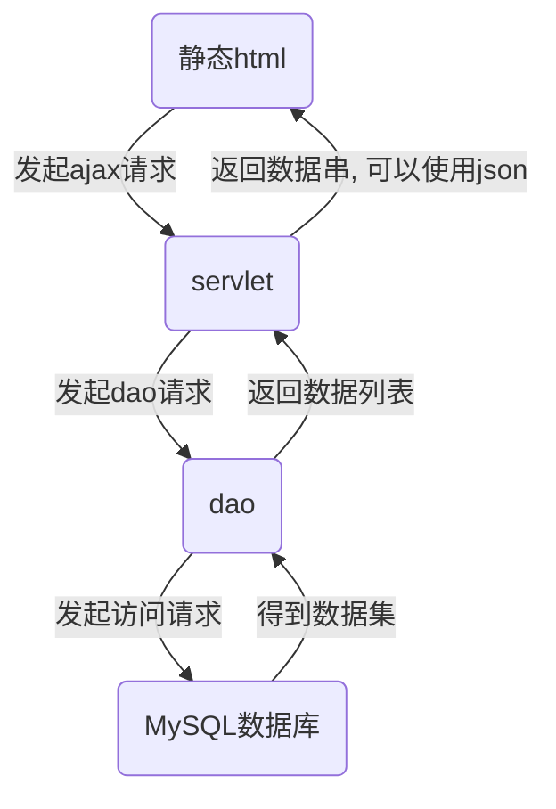

# 静态html+ajax与jsp
为什么要使用`ajax`请求，而不用`jsp`的`el`表达式和`jstl`方便的得到数据呢？

- **优点一:** 前后端分离
`jsp`是一种早期的技术，它将前后端杂糅在一起，`html`和`java`代码交错；而现在前后端分离逐渐成为业界标准，将静态`html`和后端`java`代码分开的思想有利于前后端专注于自己的工作，提高工作效率，降低维护成本。
- **优点二:** 访问速度更快
我们知道`jsp`的本质是`servlet`，因此浏览器在第一次访问`jsp`时，需要将`jsp`编译成`servlet`，这将耗费很多时间，而静态`html`就没有这样的问题。
- **优点三:** 服务器压力更小
既然`jsp`是`servlet`，那么无论是编译还是访问，都需要占用服务器资源，前后端分离可以有效缓解问题。

# ajax访问流程图

# 前期准备
## 配置jQuery
在`web`/`webapp`（具体目录名根据项目类型判断）目录下新建一个`js`目录，导入`jQuery-x.x.x.js`文件，脚本下载地址：[jQuery下载](https://jquery.com/download/)

## 准备index.html
编写一个`index.html`文件，导入`jQuery`脚本，提供一个按钮和空表格（只有表头），为按钮和表格指定`id`以便脚本调用：
```html
<!DOCTYPE html>
<html lang="en">
<head>
  <meta charset="UTF-8">
  <title>Hello Maven</title>
  <link rel="stylesheet" type="text/css" href="css/style.css">
  <script type="text/javascript" src="js/jquery-3.5.0.js"></script>
</head>
<body>
<button id="view">View Mysql By Ajax + MyBatis</button>
<table id="data">
  <tr>
    <th>ID</th>
    <th>Name</th>
    <th>Age</th>
  </tr>
</table>
</body>
```

网页效果：


## 准备dao
笔者在`dao`层用`MyBatis + MyBatis Generator`实现了一个读取数据库这种`users`数据表的方法，这个方法会访问`users`数据表，并返回一个存有数据的`List`列表（此处不是本文重点，如果不会用`MyBatis`，也可以使用`JDBC`实现）：
```java
package dao;

import mapper.UsersMapper;
import org.apache.ibatis.session.SqlSession;
import pojo.Users;
import pojo.UsersExample;

import java.util.List;

public class UsersUtil {

  public static List<Users> getAllUsers() {
    InputStream stream = Resources.getResourceAsStream("mybatis-config.xml");
    SqlSessionFactory factory = new SqlSessionFactoryBuilder().build(stream);
    SqlSession session = factory.openSession();
    UsersExample example = new UsersExample();
    example.createCriteria().andIdIsNotNull();
    UsersMapper mapper = myBatisSession.getMapper(UsersMapper.class);
    return mapper.selectByExample(example);
  }
}
```
## 准备servlet
接着在`service`层实现一个`servlet`。

此处使用`alibaba`的`fastjson.jar`（没有`jar`包的请自行下载，笔者此处使用`Maven`配置）实现列表与`json`的快速转换，最后通过`resp.getWriter().append()`把`json`字符串传出：
```java
package service;

import com.alibaba.fastjson.JSON;
import com.alibaba.fastjson.JSONArray;
import dao.UsersUtil;
import pojo.Users;

import org.apache.ibatis.io.Resources;
import javax.servlet.ServletException;
import javax.servlet.http.HttpServlet;
import javax.servlet.http.HttpServletRequest;
import javax.servlet.http.HttpServletResponse;
import java.io.IOException;
import java.util.List;

public class UsersServlet extends HttpServlet {
  @Override
  protected void doGet(HttpServletRequest req, HttpServletResponse resp) throws ServletException, IOException {
    List<Users> usersList = UsersUtil.getAllUsers();
    //JSON转字符串写入resp
    resp.getWriter().append(JSON.toJSONString(jsonArray));
  }

  @Override
  protected void doPost(HttpServletRequest req, HttpServletResponse resp) throws ServletException, IOException {
    this.doGet(req, resp);
  }
}
```

# jQuery实现ajax
在js目录中创建`loadDataAjax.js`脚本，该脚本会在网页加载完成后为`view`按钮分配`click`方法，点击后会发送`ajax`请求，得到数据并加入表格。

- `$(function(){ pass })`: 网页加载完成时会自动调用函数体
- `$("#id").click(function(){ pass })`: 监听对应id的按钮，提供`click`方法
- `$.ajax()`: `ajax`请求

关于`ajax`请求的参数：

- `url`: 请求地址
- `type`: 指定请求类型`(get/post)`
- `dataType`: 指定返回的数据类型
- `.done`: 访问成功调用的方法，其中参数`msg`是`resp`返回的数据
- `.fail`: 访问失败调用的方法

```js
//网页加载完成时调用
$(function () {
  //为id=view的按钮提供click方法
  $("#view").click(function () {
    //发送ajax请求
    $.ajax({
      url: encodeURI("sql"),
      type: "get",
      dataType: "json"
    })
      //访问成功
      .done(function (msg) {
        //清空id=data的表格第一行（表头）以外的数据
        $("#data tr:not(:first)").empty();
        //遍历返回的json数组
        $.each(msg, function (index, user) {
          //向表格中添加json数组每个元素的内容
          $("#data").append("<tr>" +
            "<td>" + user.id + "</td>" +
            "<td>" + user.name + "</td>" +
            "<td>" + user.age + "</td>" +
            "</tr>")
        })
      })
      //访问失败
      .fail(function () {
        alert("ERROR!")
      })
  })
})
```

最后在`index.html`中导入脚本：
```html
  <script type="text/javascript" src="js/loadDataAjax.js"></script>
```

网页成功返回数据并写入列表：

# 附：关于Maven项目引入js无法使用的问题
`Maven`中的`css`、`js`文件都会被过滤器过滤，要使文件可以正常使用，我们需要在`WEB-INF/web.xml`中加入以下配置：
```xml
  <servlet-mapping>
    <servlet-name>default</servlet-name>
    <url-pattern>*.js</url-pattern>
  </servlet-mapping>
  <servlet-mapping>
    <servlet-name>default</servlet-name>
    <url-pattern>*.css</url-pattern>
  </servlet-mapping>
```
