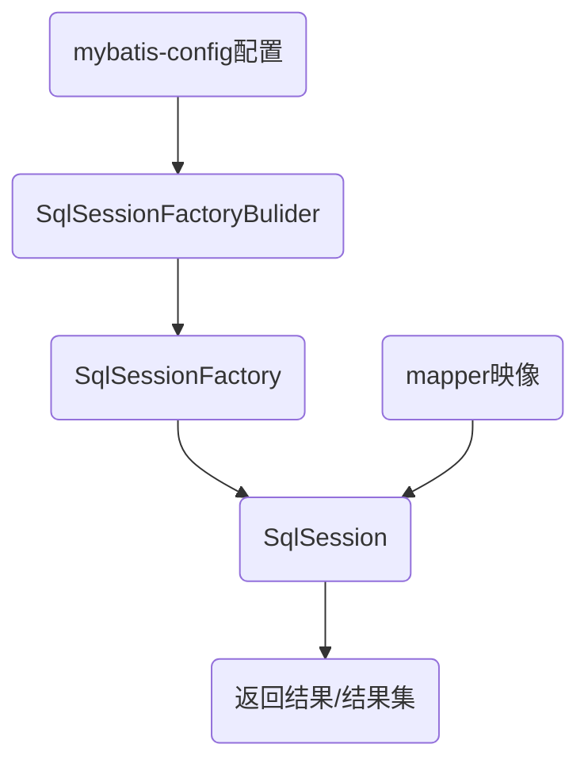

上一期中我们用`intellij idea`完成了`Maven`项目的配置，内嵌`jetty`插件构建服务器，并安装了`jstl`标签库。

我们知道可以使用`jdbc`对数据库进行增删改查，但是这样代码量很大，而且是硬编码，不够灵活多变，效率也不高。`MyBatis`为我们提供了更好的解决方案，让我们为`Maven`配置`MyBatis`框架。

----
# 提供数据库文件
我们来编写一个简单的数据表，表名为`users`，表中有`id`、`name`、`age`三个列（此处的可视化软件是`DataGrip`）：


# 配置xml文件
## 配置pom.xml
老规矩，要在`Maven`项目中使用`jar`，我们需要在`pom.xml`中引入依赖，我们为项目提供`MyBatis`框架和`MySQL`的连接：
```xml
<dependency>
  <groupId>org.mybatis</groupId>
  <artifactId>mybatis</artifactId>
  <version>3.4.5</version>
</dependency>
<dependency>
  <groupId>mysql</groupId>
  <artifactId>mysql-connector-java</artifactId>
  <version>8.0.17</version>
</dependency>
```
## 配置mybatis-config.xml
接下来，在`main/resources`目录内（如果没有就创建一个）创建`mybatis-config.xml`.

前面的配置与`jdbc`很像，就是关于驱动、`URL`、用户名和密码的设置，而最后的`<mappers>`标签，则用于指定一个映射文件，我们可以把`MySQL`的代码写在`mapper`中，这样代码就可以反复调用，极大缩小工作量。

此处`mapper`路径直接指向`UserMapper.xml`，即对应的`mapper`文件就在`mybatis-config.xml`的同级目录中。
```xml
<?xml version="1.0" encoding="UTF-8"?>
<!DOCTYPE configuration
    PUBLIC "-//mybatis.org//DTD Config 3.0//EN"
    "http://mybatis.org/dtd/mybatis-3-config.dtd">

<configuration>
  <environments default="development">
    <environment id="development">
      <transactionManager type="JDBC"/>
      <dataSource type="POOLED">
        <property name="driver" value="com.mysql.cj.jdbc.Driver"/>
        <property name="url" value="jdbc:mysql://localhost:3306/hello_mysql?useUnicode=true&amp;characterEncoding=UTF-8&amp;serverTimezone=UTC"/>
        <property name="username" value="root"/>
        <property name="password" value="123"/>
      </dataSource>
    </environment>
  </environments>
  <mappers>
    <mapper resource="UserMapper.xml"/>
  </mappers>
</configuration>
```
## 配置mapper
根据`mybatis-config`中`<mapper>`标签的配置，笔者同样在`main/resources`创建`UserMapper.xml`文件。

我在`mapper`中提供了两个方法，可以看到，方法写在`<select>`标签中：

- `selectUserById`查询`ID`并返回对应的`User`
- `selectAllUser`返回一个包含所有的User的列表。

介绍一下`mapper`中的参数：

- `namespace`：命名空间，用于区分不同的`mapper`
- `id`：相当于为`<select>`中方法提供别名，方便调用
- `parameterType`：为`<select>`方法内的变量提供类型，`MyBatis`用`#{...}`代替`?`，这里的`Integer`即指方法内的`#{uid}`是整数型
- `resultType`：指定返回的类，需提供对应实体类的路径 **(即便返回的是列表这里也提供列表的成员类型)**
```xml
<?xml version="1.0" encoding="UTF-8"?>
<!DOCTYPE mapper PUBLIC "-//mybatis.org//DTD Mapper 3.0//EN"
    "http://mybatis.org/dtd/mybatis-3-mapper.dtd">

<mapper namespace="UserMapper">
  <select id="selectUserById" parameterType="Integer" resultType="model.User">
        select * from users where id=#{uid}
    </select>
  <select id="selectAllUser" resultType="model.User">
    select * from users
  </select>
</mapper>
```

# 提供实体类
可以注意到，`mapper`中提供的返回类型是`model.User`，这显然是一个路径，于是我们就需要在这个路径下提供一个实体类：

在`main/java/model`内创建一个`User`类，指定数据库中对应的成员变量，并提供构造方法和getset方法：
```java
package model;

public class User {
  public User(int id, String name, int age) {
    this.id = id;
    this.name = name;
    this.age = age;
  }

  public int getId() {
    return id;
  }

  public String getName() {
    return name;
  }

  public int getAge() {
    return age;
  }

  private int id;
  private String name;
  private int age;
}
```
这样，之前`mapper`文件中的`resultType`就可以找到对应的实体类了。

----

# 实现读取方法
我们有很多的读取方法，笔者在这里简单实现了一个`Servlet`来直接读取，在实际项目中，我们还是应该按照规范，通过`Service`层调用`DAO`层，再对数据库进行操作。

这是`MyBatis`的工作方法，先通过配置文件创建一个工厂，再用工厂得到结果：


我们来实现一下：

```java
package service;

import java.io.IOException;
import java.io.InputStream;
import java.util.List;

import model.User;
import org.apache.ibatis.io.Resources;
import org.apache.ibatis.session.SqlSession;
import org.apache.ibatis.session.SqlSessionFactory;
import org.apache.ibatis.session.SqlSessionFactoryBuilder;

import javax.servlet.ServletException;
import javax.servlet.http.HttpServlet;
import javax.servlet.http.HttpServletRequest;
import javax.servlet.http.HttpServletResponse;

public class UserTest extends HttpServlet {
  @Override
  protected void doGet(HttpServletRequest req, HttpServletResponse resp) throws ServletException, IOException {
    try {
      //读取config配置文件
      InputStream stream = Resources.getResourceAsStream("mybatis-config.xml");
      SqlSessionFactoryBuilder builder = new SqlSessionFactoryBuilder();
      //创建一个SqlSessionFactory
      SqlSessionFactory factory = builder.build(stream);
      //得到一个SqlSession
      SqlSession session = factory.openSession();
      
      //通过SqlSession中的selectList方法返回一个User列表
      List<User> userList = session.selectList("selectAllUser");
      //请求转发，用于在主页显示数据表
      req.setAttribute("userList", userList);
      req.getRequestDispatcher(req.getContextPath() + "index.jsp").forward(req, resp);
    } catch (IOException e) {
      e.printStackTrace();
    }
  }

  @Override
  protected void doPost(HttpServletRequest req, HttpServletResponse resp) throws ServletException, IOException {
    this.doGet(req, resp);
  }
}
```
# 显示结果
此处不多介绍，因为与本文关系不大，简单的说就是提供了一个超链接跳转到`servlet`，再通过`servlet`为请求添加一个属性存放用户列表，最后使用`jstl`的`forEach`标签显示出来：

```html
<%@taglib uri="http://java.sun.com/jsp/jstl/core" prefix="c" %>
<%@ page isELIgnored="false" %>
<html>
<head>
  <title>Hello Maven + SSM</title>
  <link rel="stylesheet" type="text/css" href="css/style.css">
</head>
<body>
<h2>Hello World!</h2>
<a href=${pageContext.request.contextPath}"/sql">view by mybatis</a>
<c:if test="${!empty userList}">
  <table>
    <tr>
      <th>ID</th>
      <th>Name</th>
      <th>Age</th>
    </tr>
    <c:forEach items="${userList}" var="user">
      <tr>
        <td>${user.id}</td>
        <td>${user.name}</td>
        <td>${user.age}</td>
      </tr>
    </c:forEach>
  </table>
</c:if>
</body>
</html>
```

最后，我们就可以在主页得到结果啦：

附上目录表：

