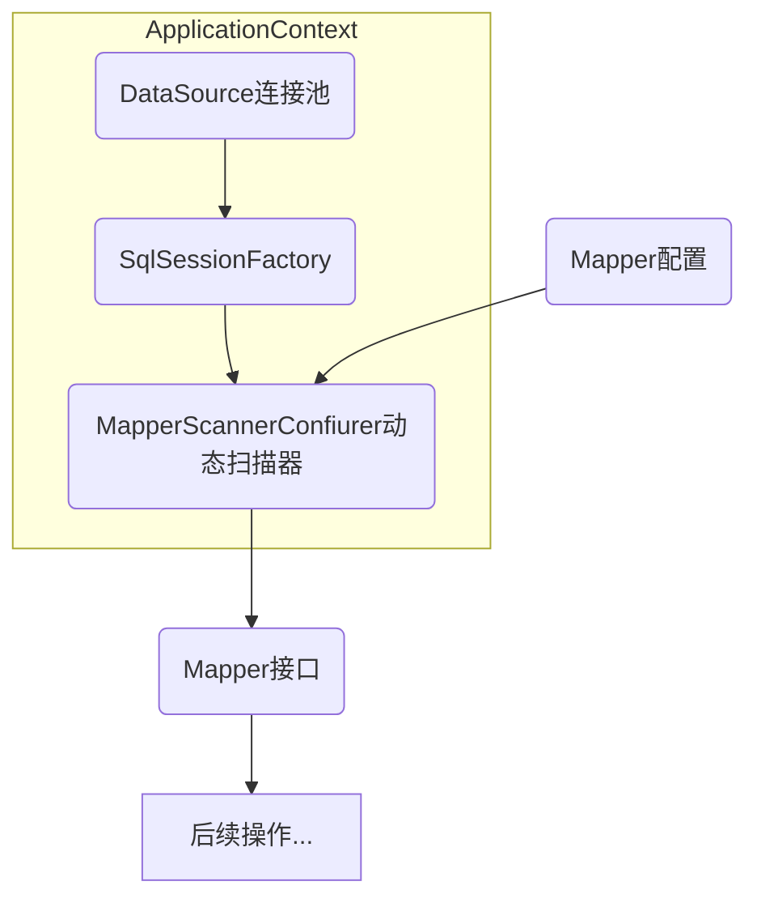

`Spring`框架是一个开放源代码的`J2EE`应用程序框架，它使得我们的开发过程更简单，可以大大减少工作量，提高效率。`spring`具有轻量化、`ioc`（控制反转）、`aop`（面向切面编程）思想、`mvc`模式等特性，在企业中被广泛使用。

今天我们使用`Maven`完成`spring`的配置以及和`MyBatis`的整合。

----
# 动态扫描过程图


----
# 配置xml
## 配置pom.xml
在`pom.xml`中加入`properties`，指定`spring`版本：
```xml
<properties>
  <spring.version>5.0.2.RELEASE</spring.version>
</properties>
```
在`<dependencies>`中引入`spring`的全部包、`mybatis`以及`mybatis-spring`整合包、`c3p0`连接池、`mysql`数据库驱动、
```xml  
<dependency>   
  <groupId>org.springframework</groupId>
  <artifactId>spring-aop</artifactId>
  <version>${spring.version}</version>
</dependency>
<dependency> 
  <groupId>org.springframework</groupId>
  <artifactId>spring-context</artifactId>
  <version>${spring.version}</version>
</dependency>
<dependency>
  <groupId>org.springframework</groupId>
  <artifactId>spring-web</artifactId>
  <version>${spring.version}</version>
</dependency>
<dependency>
  <groupId>org.springframework</groupId>
  <artifactId>spring-webmvc</artifactId>
  <version>${spring.version}</version>
</dependency>
<dependency>
  <groupId>org.springframework</groupId>
  <artifactId>spring-test</artifactId>
  <version>${spring.version}</version>
</dependency>
<dependency>
  <groupId>org.springframework</groupId>
  <artifactId>spring-jdbc</artifactId>
  <version>${spring.version}</version>
</dependency>

<dependency>
  <groupId>org.mybatis</groupId>
  <artifactId>mybatis</artifactId>
  <version>3.4.5</version>
</dependency>
<dependency>
  <groupId>org.mybatis</groupId>
  <artifactId>mybatis-spring</artifactId>
  <version>1.3.0</version>
</dependency>

<dependency>
  <groupId>mysql</groupId> 
  <artifactId>mysql-connector-java</artifactId>
  <version>8.0.17</version>
</dependency>
<dependency>
  <groupId>com.mchange</groupId>
  <artifactId>c3p0</artifactId>
  <version>0.9.5.2</version>
</dependency>
```

## 配置ApplicationContext.xml
在`resources`目录中创建`ApplicationContext.xml`，引入以下内容：

`mybatis-spring.jar`提供了很多方便的类：

- `SqlSessionFactoryBean`可以直接配置`SqlSessionFactory`而不需要我们提供`mybatis-config.xml`配置文件。
需要参数`dataSource`: 提供一个连接池
- `MapperScannerConfigurer`会自动扫描`mapper`包内的所有`mapper`映射文件，使得我们直接一步直接获得`mapper`接口
它会自动读取`ApplicationContext.xml`中配置的`SqlSessionFactoryBean`工厂类，并自动生成所有的`mapper`接口
需要参数`basePackage`: 指定`mapper`包的位置
```xml
<beans xmlns="http://www.springframework.org/schema/beans"
       xmlns:xsi="http://www.w3.org/2001/XMLSchema-instance"
       xsi:schemaLocation="http://www.springframework.org/schema/beans
        http://www.springframework.org/schema/beans/spring-beans.xsd">

  <!-- 配置c3p0连接池 -->
  <bean name="dataSource" class="com.mchange.v2.c3p0.ComboPooledDataSource">
    <property name="driverClass" value="com.mysql.cj.jdbc.Driver"/>
    <property name="jdbcUrl"
              value="jdbc:mysql://localhost:3306/hello_mysql?useUnicode=true&amp;characterEncoding=UTF-8&amp;serverTimezone=UTC"/>
    <property name="user" value="root"/>
    <property name="password" value="123"/>
  </bean>

  <!-- 配置SqlSessionFactory -->
  <bean name="sqlSessionFactory" class="org.mybatis.spring.SqlSessionFactoryBean">
    <property name="dataSource" ref="dataSource"/>
  </bean>

  <!-- 配置MapperScannerConfigur动态扫描 -->
  <bean class="org.mybatis.spring.mapper.MapperScannerConfigurer">
    <property name="basePackage" value="mapper"/>
  </bean>
</beans>
```
通过`mybatis-spring`的整合，我们就不需要再配置`mybatis-config.xml`了。

----

# 提供bean和mapper
要实现动态扫描开发，我们需要提供一个`bean`实现类，并且提供`mapper`接口和对应的`mapper.xml`配置文件。

笔者这里直接使用`MyBatis Generator`生成了`bean(pojo)`实现类和`mapper`配置文件以及`mapper`接口：

`pojo/Users`中生成的实现类：
```java
package pojo;

public class Users {
  private Integer id;
  String name;
  private Integer age;

  public Users(Integer id, String name, Integer age) {
    this.id = id;
    this.name = name;
    this.age = age;
  }

  public Users() {
    super();
  }

  public Integer getId() {
    return id;
  }

  public void setId(Integer id) {
    this.id = id;
  }

  public String getName() {
    return name;
  }

  public void setName(String name) {
    this.name = name == null ? null : name.trim();
  }

  public Integer getAge() {
    return age;
  }

  public void setAge(Integer age) {
    this.age = age;
  }

  @Override
  public String toString() {
    return id + ", " + name + ", " + age;
  }
}
```

`mapper/UsersMapper`中生成的接口文件，`MyBatis Generator`为我们自动生成了各种方法: 
```java
package mapper;

import java.util.List;
import org.apache.ibatis.annotations.Param;
import pojo.Users;
import pojo.UsersExample;

public interface UsersMapper {
    long countByExample(UsersExample example);
    int deleteByExample(UsersExample example);
    int deleteByPrimaryKey(Integer id);
    int insert(Users record);
    int insertSelective(Users record);
    List<Users> selectByExample(UsersExample example);
    Users selectByPrimaryKey(Integer id);
    int updateByExampleSelective(@Param("record") Users record, @Param("example") UsersExample example);
    int updateByExample(@Param("record") Users record, @Param("example") UsersExample example);
    int updateByPrimaryKeySelective(Users record);
    int updateByPrimaryKey(Users record);
}
```

----

# 实现访问数据库
基于`mybatis-spring`下的动态扫描开发，要访问数据库非常简单，笔者此处实现了一个`UsersTest`类，使用`junit`进行测试，只需3行代码我们就可以访问数据库并返回数据了：

```java
package test;

import mapper.UsersMapper;
import org.junit.Test;
import org.springframework.context.ApplicationContext;
import org.springframework.context.support.ClassPathXmlApplicationContext;
import pojo.Users;

public class UsersTest {
  @Test
  public void test1() {
    //读取spring配置文件
    ApplicationContext applicationContext = new ClassPathXmlApplicationContext("ApplicationContext.xml");
    //得到mapper映射接口
    UsersMapper mapper = applicationContext.getBean(UsersMapper.class);
    //执行mapper中的操作
    Users user = mapper.selectByPrimaryKey(1);
    //输出结果
    System.out.println(user);
  }
}
```

测试成功，控制台中正确返回了结果（此处`DEBUG`数据来自`log4j`）：
```java
DEBUG [main] - JDBC Connection [com.mchange.v2.c3p0.impl.NewProxyConnection@410ae9a3 [wrapping: com.mysql.cj.jdbc.ConnectionImpl@319988b0]] will not be managed by Spring
DEBUG [main] - ==>  Preparing: select id, name, age from users where id = ? 
DEBUG [main] - ==> Parameters: 1(Integer)
DEBUG [main] - <==      Total: 1
DEBUG [main] - Closing non transactional SqlSession [org.apache.ibatis.session.defaults.DefaultSqlSession@7d3430a7]
DEBUG [main] - Returning JDBC Connection to DataSource
1, Adam, 13
```

完整目录（此处`service`包可忽略）：

