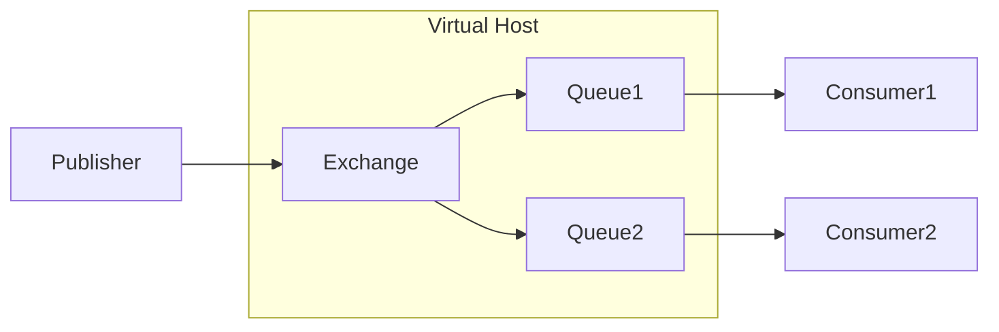

> MQ（Message Queue）消息队列，是基础数据结构中“先进先出”的一种数据结构。一般用来解决应用解耦，异步消息，流量削锋等问题，实现高性能，高可用，可伸缩和最终一致性架构。
>
> —— 摘自百度百科

# 什么是MQ？

MQ(Message Queue)，即消息队列，是一种进程或线程间通信的方式。队列可以储存一系列输入，通常来自用户；接着，队列中的信息以一定的方式发送给接收者，从而实现信息的推送。

## MQ的作用

> 消息队列中间件是分布式系统中重要的组件，主要解决应用解耦，异步消息，流量削锋等问题，实现高性能，高可用，可伸缩和最终一致性架构。
>
> 解耦：一个业务需要多个模块共同实现，或者一条消息有多个系统需要对应处理，只需要主业务完成以后，发送一条MQ，其余模块消费MQ消息，即可实现业务，降低模块之间的耦合。
>
> 异步：主业务执行结束后从属业务通过MQ，异步执行，减低业务的响应时间，提高用户体验。
>
> 削峰：高并发情况下，业务异步处理，提供高峰期业务处理能力，避免系统瘫痪。
>
> —— 摘自百度百科

## 主要的MQ产品与对比

----

| 主要产品   | ActiveMQ | RabbitMQ | Kafka    | RocketMQ   |
| ---------- | -------- | -------- | -------- | ---------- |
| 单机吞吐量 | 万级     | 万级     | 10万级   | 10万级     |
| 时效性     | 毫秒     | 微秒     | 毫秒     | 毫秒       |
| 可用性     | 高       | 高       | 非常高   | 非常高     |
| 功能支持   | 完善     | 完善     | 较为完善 | 较为完善   |
| 语言支持   | Java优先 | 无关     | Java优先 | 只支持Java |

总结：

ActiveMQ：

- 优点：老牌MQ，功能完备，设计成熟
- 缺点：效率不高，不适合数据量过大的应用场景，大企业很少使用；社区不活跃，维护较少

RabbitMQ：

- 优点：基于erlang语言开发，性能较好；支持AMQP协议；社区活跃，使用量大
- 缺点：不了解erlang语言的人很难进行维护和扩展

Kafka：

- 优点：大数据领域常用MQ，效率高
- 缺点：功能较少

RocketMQ：

- 优点：由阿里团队基于Java开发，效率很高；模型简单，接口易用
- 缺点：目前设计不够成熟，文档较少

## 了解AMQP协议

AMQP（Advanced Message Queuing Protocol，高级消息队列协议）是一个进程间传递异步消息的网络协议。

AMQP协议分为发布者(Publisher)、交换机(Exchange)、队列(Queue)、消费者(Consumer)4个部分，而交换机和队列组成AMQP实体，或称为一个虚拟主机。



其中，发布者、交换机、队列、消费者都可以有多个。

# 安装与运行RabbitMQ

说了这么多，接下来就开始实际安装吧。

笔者此处使用的系统是基于WSL的Ubuntu20.04。

第一步，安装erlang：

由于RabbitMQ依赖erlang，所以我们必须先安装erlang：

```shell
sudo apt install erlang-nox
erl    # 运行测试
```

第二步，添加公钥：

```shell
wget -O- https://www.rabbitmq.com/rabbitmq-release-signing-key.asc | sudo apt-key add -
sudo apt update
```

第三步，安装RabbitMQ:

```shell
sudo apt install rabbitmq-server
```

到这里就安装完成了，为了方便管理，我们可以启用Management Plugin插件：

```shell
sudo rabbitmq-plugins enable rabbitmq_management
sudo service rabbitmq-server restart  # 重启服务
```

然后，我们就可以通过[http://localhost:15672](http://localhsot:15672)管理RabbitMQ了。

注意，15672是管理插件的端口，RabbitMQ的运行端口是5672.


默认账号：guest，默认密码：guest.

我们可以在管理页面里新建一个账号：


接着，给账号配置允许访问的虚拟主机，对于每一个项目，我们可以建立一个或多个虚拟主机，使得不同的项目和账号间互相隔离，互不影响。


# Hello World!

## 最简单的模型

最简单的模型由发布者、队列、消费者组成，这里没有出现交换机，但是事实上，RabbitMQ会创建一个默认的交换机来处理消息。


默认交换机：


接下来我们就来用Java实现一下。

## Java实现Hello World

### 前期准备

新建一个名为/demo的虚拟主机，并新建一个名为admin的账号，并允许admin访问demo.


### 导入依赖

新建一个Maven项目，导入依赖：

```xml
  <dependencies>
    <!-- Rabbitmq client -->
    <dependency>
      <groupId>com.rabbitmq</groupId>
      <artifactId>amqp-client</artifactId>
      <version>5.9.0</version>
    </dependency>

    <!-- Junit -->
    <dependency>
      <groupId>junit</groupId>
      <artifactId>junit</artifactId>
      <version>4.12</version>
      <scope>test</scope>
    </dependency>

    <!-- Slf4j -->
    <dependency>
      <groupId>org.jboss.forge.addon</groupId>
      <artifactId>slf4j</artifactId>
      <version>1.7.13</version>
    </dependency>
  </dependencies>
```

### Publisher类

publish的过程分为8步：

- 新建一个`ConnectionFactory`工厂类，并配置参数：主机、端口、用户名、密码、虚拟主机
- 通过`ConnectionFactory`得到一个新连接
- 通过新连接创建一个新管道(Channel)
- 通过管道声明队列
- *通过管道声明交换机(没有交换机则使用默认)
- *绑定交换机和队列之间的规则(接上一步)
- 通过管道发布消息
- 资源释放

#### 声明队列方法

`queueDeclare(String queue, boolean durable, boolean exclusive, boolean autoDelete, Map<String, Object> arguments) `

- 第一个参数  queue：字符串形式，声明队列名
- 第二个参数  durable：是否持久化，设置为true则服务重启之后队列仍然存在
- 第三个参数  exclusive：是否独占，设置为true则只有当前管道可以访问；并且连接断开时队列自动删除
- 第四个参数  autoDelete：是否在队列内没有资源并且连接断开时自动删除
- 第五个参数  arguments：额外参数

#### 发布消息方法

`basicPublish(String exchange, String routingKey, BasicProperties props, byte[] body) `

- 第一个参数  exchange：字符串形式，确定交换机，空串代表使用默认交换机，**不要传入null**
- 第二个参数  routingKey：字符串形式，路由键，之后会涉及，**使用默认交换机时传入队列名即可**
- 第三个参数  props：基本配置，无配置则传入null
- 第四个参数  body：字节数组形式，消息体

```java
package org.koorye.testrabbitmq;

import com.rabbitmq.client.Channel;
import com.rabbitmq.client.Connection;
import com.rabbitmq.client.ConnectionFactory;
import org.junit.Test;

public class Producer {
  @Test
  public void TestSendMsg() {
    ConnectionFactory factory = new ConnectionFactory();
    factory.setHost("localhost");
    factory.setPort(5672);
    factory.setUsername("admin");
    factory.setPassword("admin");
    factory.setVirtualHost("/demo");

    Connection connection = null;
    Channel channel = null;
    try {
      connection = factory.newConnection();
      channel = connection.createChannel();

      channel.queueDeclare("hello world", true, false, false, null);
      String msg = "Hello World!";
      channel.basicPublish("", "hello world", null, msg.getBytes());
      System.out.println("[ INFO ] Send message: " + msg);
    } catch (Exception e) {
      e.printStackTrace();
    } finally {
      try {
        if (channel != null)
          channel.close();
        if (connection != null)
          connection.close();
      } catch (Exception e) {
        e.printStackTrace();
      }
    }
  }
}
```

运行：

```shell
[ INFO ] Send message: Hello World!

Process finished with exit code 0
```

再次查看管理页面，注意到新消息加入队列：


在这里插入图片描述


### Consumer类

接收的过程分为8步，其中大部分和发布是相同的：

- 新建一个`ConnectionFactory`工厂类，并配置参数：主机、端口、用户名、密码、虚拟主机
- 通过`ConnectionFactory`得到一个新连接
- 通过新连接创建一个新管道(Channel)
- 通过管道声明队列
- *通过管道声明交换机(没有交换机则使用默认)
- *绑定交换机和队列之间的规则(接上一步)
- 声明消费者，定义接收方式
- 通过管道让消费者接收信息

#### `DefaultConsumer`类

`DefaultConsumer`类构造时需要传入一个管道，接着，重载其中的`handleDelivery(String consumerTag, Envelope envelope, AMQP.BasicProperties properties, byte[] body)`方法，方法有4个参数：

- 第一个参数  cousumerTag  字符串类型，标记，用于ACK确认
- 第二个参数  envelope  消息信封，可以通过信封得到交换机、路由键等信息
- 第三个参数  properties  消息的配置
- 第四个参数  body  字符数组类型，消息体

#### 接收消息方法

`basicConsume(String queue, boolean autoAck, Consumer callback)`

- 第一个参数  queue：字符串类型，指定接收的队列
- 第二个参数  autoAck：是否自动进行ACK确认
- 第三个参数  callback：回调函数，指定接收消息的消费者

> ACK (Acknowledge character）即是确认字符，在数据通信中，接收站发给发送站的一种传输类控制字符。表示发来的数据已确认接收无误。
>
> —— 摘自百度百科

需要说明的是，callback说明了接收消息时会以异步的形式调用Consumer类的`handleDelivery`方法，而`handleDelivery`是一个循环接收消息的阻塞方法，因此，接收消息会一直进行，直到程序结束。

*注：Junit单元测试对RabbitMQ接收消息的异步支持存在问题，因此我们这里使用main函数测试。*

```java
package org.koorye.testrabbitmq;

import com.rabbitmq.client.*;

import java.io.IOException;

public class Consumer {
  private static final String QUEUE = "hello world";

  public static void main(String[] args) {
    ConnectionFactory factory = new ConnectionFactory();
    factory.setHost("localhost");
    factory.setPort(5672);
    factory.setUsername("admin");
    factory.setPassword("admin");
    factory.setVirtualHost("/demo");

    Connection connection;
    Channel channel;
    try {
      connection = factory.newConnection();
      channel = connection.createChannel();

      channel.queueDeclare(QUEUE, true, false, false, null);

      DefaultConsumer consumer = new DefaultConsumer(channel) {
        @Override
        public void handleDelivery(String consumerTag, Envelope envelope, AMQP.BasicProperties properties, byte[] body) throws IOException {
          System.out.println("[ Info ] Deilver message: " + new String(body, "utf-8"));
        }
      };

      channel.basicConsume(QUEUE, true, consumer);
    } catch (Exception e) {
      e.printStackTrace();
    }
  }
}
```

运行：

```shell
[ Info ] Deilver message: Hello World!

# 注意没有return 0，程序并没有结束
```

再次查看管理页面，消息已经被取出。


