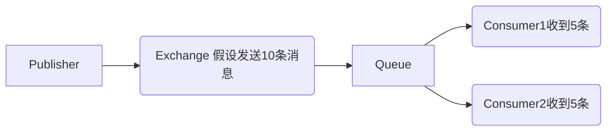
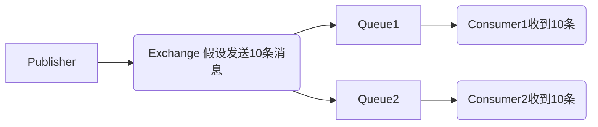
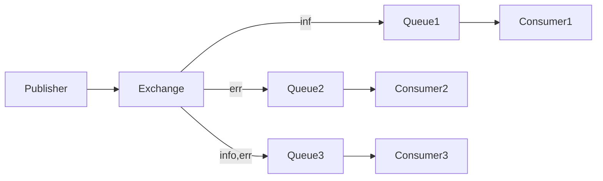
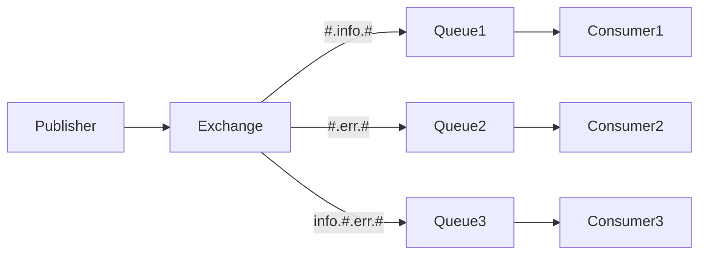

上一期的Hello World模型是RabbitMQ最简单的工作模式，这一期我们将继续深入，了解RabbitMQ更为复杂的工作模式。

# RabbitMQ的五种交换机模式

RabbitMQ共有简单模式(simple)、工作模式(work)、发布订阅(广播)模式(fanout)、路由(直连)模式(direct)、主题(通配符)模式(topic).

除此之外还有headers和RPC模式，本文不再涉及。

简单模式即hello world模型，本文不再介绍。

## 工作模式

工作模式，指多个消费者接收同一个队列。

在这种情况下，RabbitMQ会采用**轮询**的方式将消息平均分发到消费者中。这种像分配工作一样的模式，被称为工作模式。



很好理解，本文不再进行实际演示。

## 发布订阅模式

发布订阅模式，指交换机直接与多个队列相连。

这种情况下，交流机会同时给两条队列发送相同的消息。



## 路由模式

路由模式在发布订阅模式的基础上增加了路由键，路由键可以用来确定信息的发送对象。




如图，交换机和队列之间可以指定路由键，发布消息时也可以指定路由键。只有路由键匹配，队列才会收到消息。

例如，如果路由键为info，则只有Queue1和Queue2收到消息。

## 主题模式

主题模式在路由模式的基础上对路由键做出了优化，可以使用通配符来匹配发送对象。

通配符类型：

- `#`  表示空、一个或多个词
- `*`  表示一个词

如`info.#`可以匹配`info.submit`也可以匹配`info.submit.primary`，而`info.*`只可以匹配`info.submit`.



如图，当发送info时，只有Queue1可以收到；当发送err时，只有Queue2可以收到；当发送info.err时，所有队列则都可以收到。

# Java实现五种模式

## 前期准备

既然Publisher和Consumer的大部分代码都相同，那么我们就可以用工具类将其封装。

新建一个RabbitMQUtil类，提供静态方法getConnection和closeConnection.

```java
package org.koorye.util;

import com.rabbitmq.client.Channel;
import com.rabbitmq.client.Connection;
import com.rabbitmq.client.ConnectionFactory;

import java.io.IOException;
import java.util.concurrent.TimeoutException;

public class RabbitMQUtil {
  public static Connection getConnection() throws IOException, TimeoutException {
    ConnectionFactory factory = new ConnectionFactory();
    factory.setHost("localhost");
    factory.setPort(5672);
    factory.setUsername("admin");
    factory.setPassword("admin");
    factory.setVirtualHost("/demo");
    return factory.newConnection();
  }

  public static void closeConnection(Channel channel, Connection connection) throws IOException, TimeoutException {
    if (channel != null)
      channel.close();
    if (connection != null)
      connection.close();
  }
}
```

## 发布订阅模式

### Publisher

在hello world模型的基础上，发布订阅模型多了几步：

- 声明交换机
- 绑定队列和交换机

#### 声明交换机方法

` exchangeDeclare(String exchange, BuiltinExchangeType type)`

- 第一个参数  exchange：字符串类型，交换机名称
- 第二个参数  type：交换机类型，共有FANOUT / DIRECT / TOPIC / HEADERS四种

#### 绑定队列和交换机方法

`queueBind(String queue, String exchange, String routingKey)`

- 第一个参数  queue：字符串类型，队列名称
- 第二个参数  exchange：字符串类型，交换机名称
- 第三个参数  routingKey：字符串类型，路由键

订阅发布模式不需要指定路由键，因此路由键为空。

接着，发布消息时指定交换机即可，路由键也为空。

```java
package org.koorye.testrabbitmq;

import com.rabbitmq.client.BuiltinExchangeType;
import com.rabbitmq.client.Channel;
import com.rabbitmq.client.Connection;
import org.junit.Test;
import org.koorye.util.RabbitMQUtil;

public class Publisher {
  @Test
  public void TestSendMsg() {
    Connection connection = null;
    Channel channel = null;
    try {
      connection = RabbitMQUtil.getConnection();
      channel = connection.createChannel();

      channel.queueDeclare("user1", true, false, false, null);
      channel.queueDeclare("user2", true, false, false, null);

      channel.exchangeDeclare("logs", BuiltinExchangeType.FANOUT);

      channel.queueBind("user1", "logs", "");
      channel.queueBind("user2", "logs", "");

      channel.basicPublish("logs", "", null, "hello world".getBytes());
    } catch (Exception e) {
      e.printStackTrace();
    } finally {
      try {
        RabbitMQUtil.closeConnection(channel, connection);
      } catch (Exception e) {
        e.printStackTrace();
      }
    }
  }
}
```

### Consumer

接收消息同样需要声明交换机、绑定队列和交换机。

这次笔者直接将DefaultConsumer放到callback上，这样代码更简洁，也更符合回调函数的格式。

```java
package org.koorye.testrabbitmq;

import com.rabbitmq.client.*;
import org.koorye.util.RabbitMQUtil;

import java.io.IOException;

public class Consumer1 {
  public static void main(String[] args) {
    try {
      Connection connection = RabbitMQUtil.getConnection();
      Channel channel = connection.createChannel();

      channel.queueDeclare("user1", true, false, false, null);

      channel.exchangeDeclare("logs", BuiltinExchangeType.FANOUT);

      channel.queueBind("user1", "logs", "");

      channel.basicConsume("user1", true, new DefaultConsumer(channel) {
        @Override
        public void handleDelivery(String consumerTag, Envelope envelope, AMQP.BasicProperties properties, byte[] body) throws IOException {
          System.out.println("[ INFO ] Deliver message: " + new String(body));
        }
      });
    } catch (Exception e) {
      e.printStackTrace();
    }
  }
}
```

以同样的格式实现一个Consumer2，接收user2队列：

```java
package org.koorye.testrabbitmq;

import com.rabbitmq.client.*;
import org.koorye.util.RabbitMQUtil;

import java.io.IOException;

public class Consumer2 {
  public static void main(String[] args) {
    try {
      Connection connection = RabbitMQUtil.getConnection();
      Channel channel = connection.createChannel();

      channel.queueDeclare("user2", true, false, false, null);

      channel.exchangeDeclare("logs", BuiltinExchangeType.FANOUT);

      channel.queueBind("user2", "logs", "");

      channel.basicConsume("user2", true, new DefaultConsumer(channel) {
        @Override
        public void handleDelivery(String consumerTag, Envelope envelope, AMQP.BasicProperties properties, byte[] body) throws IOException {
          System.out.println("[ INFO ] Deliver message: " + new String(body));
        }
      });
    } catch (Exception e) {
      e.printStackTrace();
    }
  }
}
```

运行后：

Consumer1

```shell
[ INFO ] Deliver message: hello world
```

Consumer2

```shell
[ INFO ] Deliver message: hello world
```

## 路由模式

### Publisher

路由模式只是在发布订阅模式上增加了路由键，因此我们也只需对代码稍加修改即可。

- 将声明的交流机类型改成`BuiltinExchangeType.DIRECT`
- 发布消息时带上路由键

```java
package org.koorye.testrabbitmq;

import com.rabbitmq.client.BuiltinExchangeType;
import com.rabbitmq.client.Channel;
import com.rabbitmq.client.Connection;
import org.junit.Test;
import org.koorye.util.RabbitMQUtil;

public class Publisher {
  @Test
  public void TestSendMsg() {
    Connection connection = null;
    Channel channel = null;
    try {
      connection = RabbitMQUtil.getConnection();
      channel = connection.createChannel();

      channel.queueDeclare("user1", true, false, false, null);
      channel.queueDeclare("user2", true, false, false, null);
      channel.queueDeclare("user3", true, false, false, null);

      channel.exchangeDeclare("logs", BuiltinExchangeType.DIRECT);

      channel.queueBind("user1", "logs", "info");
      channel.queueBind("user2", "logs", "err");
      channel.queueBind("user3", "logs", "info");
      channel.queueBind("user3", "logs", "err");

      channel.basicPublish("logs", "info", null, "this is a info".getBytes());
      channel.basicPublish("logs", "err", null, "this is a err".getBytes());
    } catch (Exception e) {
      e.printStackTrace();
    } finally {
      try {
        RabbitMQUtil.closeConnection(channel, connection);
      } catch (Exception e) {
        e.printStackTrace();
      }
    }
  }
}
```

### Consumer

根据上面的例子，实现3个消费者，代码大同小异。

Consumer1:

```java
package org.koorye.testrabbitmq;

import com.rabbitmq.client.*;
import org.koorye.util.RabbitMQUtil;

import java.io.IOException;

public class Consumer1 {
  public static void main(String[] args) {
    try {
      Connection connection = RabbitMQUtil.getConnection();
      Channel channel = connection.createChannel();

      channel.queueDeclare("user1", true, false, false, null);

      channel.exchangeDeclare("logs", BuiltinExchangeType.DIRECT);

      channel.queueBind("user1", "logs", "info");

      channel.basicConsume("user1", true, new DefaultConsumer(channel) {
        @Override
        public void handleDelivery(String consumerTag, Envelope envelope, AMQP.BasicProperties properties, byte[] body) throws IOException {
          System.out.println("[ INFO ] Deliver message: " + new String(body));
        }
      });
    } catch (Exception e) {
      e.printStackTrace();
    }
  }
}
```

Consumer2:

```java
package org.koorye.testrabbitmq;

import com.rabbitmq.client.*;
import org.koorye.util.RabbitMQUtil;

import java.io.IOException;

public class Consumer2 {
  public static void main(String[] args) {
    try {
      Connection connection = RabbitMQUtil.getConnection();
      Channel channel = connection.createChannel();

      channel.queueDeclare("user2", true, false, false, null);

      channel.exchangeDeclare("logs", BuiltinExchangeType.DIRECT);

      channel.queueBind("user2", "logs", "err");

      channel.basicConsume("user2", true, new DefaultConsumer(channel) {
        @Override
        public void handleDelivery(String consumerTag, Envelope envelope, AMQP.BasicProperties properties, byte[] body) throws IOException {
          System.out.println("[ INFO ] Deliver message: " + new String(body));
        }
      });
    } catch (Exception e) {
      e.printStackTrace();
    }
  }
}
```

Consumer3:

```java
package org.koorye.testrabbitmq;

import com.rabbitmq.client.*;
import org.koorye.util.RabbitMQUtil;

import java.io.IOException;

public class Consumer3 {
  public static void main(String[] args) {
    try {
      Connection connection = RabbitMQUtil.getConnection();
      Channel channel = connection.createChannel();

      channel.queueDeclare("user3", true, false, false, null);

      channel.exchangeDeclare("logs", BuiltinExchangeType.DIRECT);

      channel.queueBind("user3", "logs", "info");
      channel.queueBind("user3", "logs", "err");

      channel.basicConsume("user3", true, new DefaultConsumer(channel) {
        @Override
        public void handleDelivery(String consumerTag, Envelope envelope, AMQP.BasicProperties properties, byte[] body) throws IOException {
          System.out.println("[ INFO ] Deliver message: " + new String(body));
        }
      });
    } catch (Exception e) {
      e.printStackTrace();
    }
  }
}
```

**运行前记得先将之前fanout模式的交换机删除！**

运行：

Consumer1:

```shell
[ INFO ] Deliver message: this is a info
```

Consumer2:

```shell
[ INFO ] Deliver message: this is a err
```

Consumer3:

```shell
[ INFO ] Deliver message: this is a info
[ INFO ] Deliver message: this is a err
```

## 主题模式

### Publisher

从直连模式改成主题模式就更加简单，只需修改交换机类型，再书写通配符即可。

实现上图的例子：

```java
package org.koorye.testrabbitmq;

import com.rabbitmq.client.BuiltinExchangeType;
import com.rabbitmq.client.Channel;
import com.rabbitmq.client.Connection;
import org.junit.Test;
import org.koorye.util.RabbitMQUtil;

public class Publisher {
  @Test
  public void TestSendMsg() {
    Connection connection = null;
    Channel channel = null;
    try {
      connection = RabbitMQUtil.getConnection();
      channel = connection.createChannel();

      channel.queueDeclare("user1", true, false, false, null);
      channel.queueDeclare("user2", true, false, false, null);
      channel.queueDeclare("user3", true, false, false, null);

      channel.exchangeDeclare("logs", BuiltinExchangeType.TOPIC);

      channel.queueBind("user1", "logs", "#.info.#");
      channel.queueBind("user2", "logs", "#.err.#");
      channel.queueBind("user3", "logs", "info.#.err.#");

      channel.basicPublish("logs", "info", null, "this is a info".getBytes());
      channel.basicPublish("logs", "err", null, "this is a err".getBytes());
      channel.basicPublish("logs", "info.err", null, "this is a info and err".getBytes());
    } catch (Exception e) {
      e.printStackTrace();
    } finally {
      try {
        RabbitMQUtil.closeConnection(channel, connection);
      } catch (Exception e) {
        e.printStackTrace();
      }
    }
  }
}
```

### Consumer

Consumer1:

```java
package org.koorye.testrabbitmq;

import com.rabbitmq.client.*;
import org.koorye.util.RabbitMQUtil;

import java.io.IOException;

public class Consumer1 {
  public static void main(String[] args) {
    try {
      Connection connection = RabbitMQUtil.getConnection();
      Channel channel = connection.createChannel();

      channel.queueDeclare("user1", true, false, false, null);

      channel.exchangeDeclare("logs", BuiltinExchangeType.TOPIC);

      channel.queueBind("user1", "logs", "#.info.#");

      channel.basicConsume("user1", true, new DefaultConsumer(channel) {
        @Override
        public void handleDelivery(String consumerTag, Envelope envelope, AMQP.BasicProperties properties, byte[] body) throws IOException {
          System.out.println("[ INFO ] Deliver message: " + new String(body));
        }
      });
    } catch (Exception e) {
      e.printStackTrace();
    }
  }
}
```

Consumer2:

```java
package org.koorye.testrabbitmq;

import com.rabbitmq.client.*;
import org.koorye.util.RabbitMQUtil;

import java.io.IOException;

public class Consumer2 {
  public static void main(String[] args) {
    try {
      Connection connection = RabbitMQUtil.getConnection();
      Channel channel = connection.createChannel();

      channel.queueDeclare("user2", true, false, false, null);

      channel.exchangeDeclare("logs", BuiltinExchangeType.TOPIC);

      channel.queueBind("user2", "logs", "#.err.#");

      channel.basicConsume("user2", true, new DefaultConsumer(channel) {
        @Override
        public void handleDelivery(String consumerTag, Envelope envelope, AMQP.BasicProperties properties, byte[] body) throws IOException {
          System.out.println("[ INFO ] Deliver message: " + new String(body));
        }
      });
    } catch (Exception e) {
      e.printStackTrace();
    }
  }
}
```

Consumer3:

```java
package org.koorye.testrabbitmq;

import com.rabbitmq.client.*;
import org.koorye.util.RabbitMQUtil;

import java.io.IOException;

public class Consumer3 {
  public static void main(String[] args) {
    try {
      Connection connection = RabbitMQUtil.getConnection();
      Channel channel = connection.createChannel();

      channel.queueDeclare("user3", true, false, false, null);

      channel.exchangeDeclare("logs", BuiltinExchangeType.TOPIC);

      channel.queueBind("user3","logs","info.#.err.#");

      channel.basicConsume("user3", true, new DefaultConsumer(channel) {
        @Override
        public void handleDelivery(String consumerTag, Envelope envelope, AMQP.BasicProperties properties, byte[] body) throws IOException {
          System.out.println("[ INFO ] Deliver message: " + new String(body));
        }
      });
    } catch (Exception e) {
      e.printStackTrace();
    }
  }
}
```

**同样记得先删除之前生成的交换机！**

运行：

Consumer1:

```shell
[ INFO ] Deliver message: this is a info
[ INFO ] Deliver message: this is a info and err
```

Consumer2:

```shell
[ INFO ] Deliver message: this is a err
[ INFO ] Deliver message: this is a info and err
```

Consumer3:

```shell
[ INFO ] Deliver message: this is a info and err
```

测试全都成功！