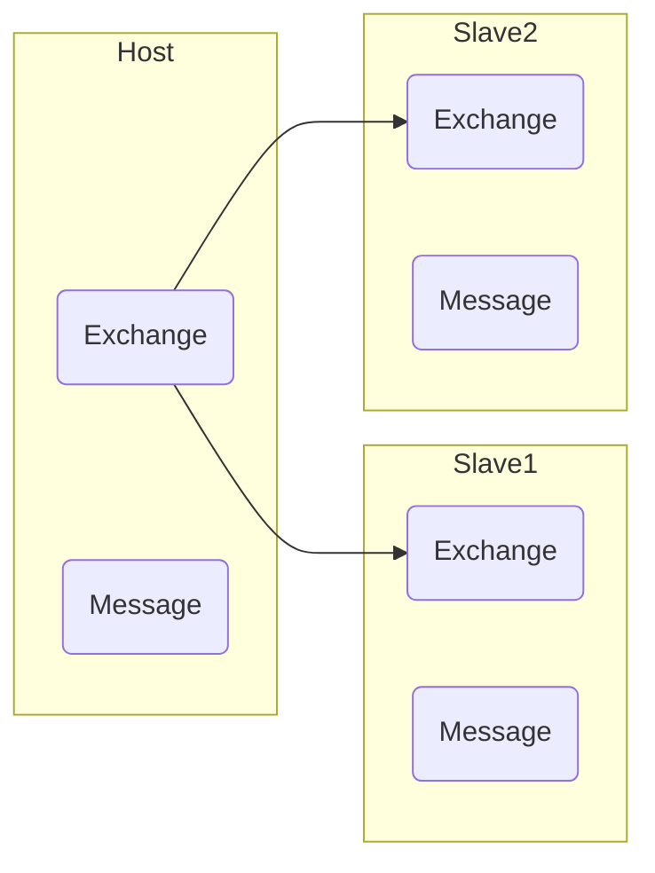
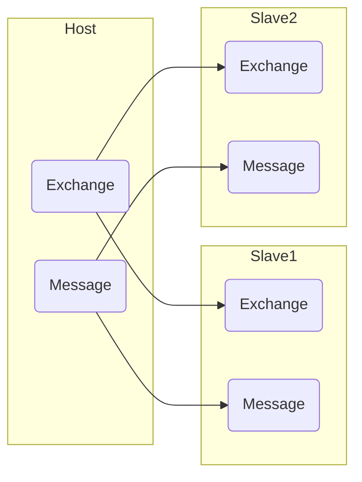

搭建RabbitMQ集群可以在一台RabbitMQ宕机时让另一台继续工作，同时可以添加更多节点来扩展消息通信的吞吐量。本期我们就来搭建RabbitMQ集群。

# RabbitMQ的集群模式

## 普通模式

RabbitMQ的普通模式支持交换机、队列结构等同步，但不支持队列中消息体的同步。这也意味着，如果主机宕机，从机中并不会存有消息体的内容。

这种模式下，从机事实上不能在主机宕机时代替主机继续使用。




## 镜像模式

镜像模式基于普通模式实现。

镜像模式下，队列中的消息体同样可以同步。其原理是，队列会打包成一个镜像发放给从机。



# 实现普通模式集群

## 启动容器

笔者使用docker模拟多台RabbitMQ服务器。

下载RabbitMQ镜像：

```shell
sudo docker pull rabbitmq:3.8.5-management
```

启动3个端口：

```shell
sudo docker run -d \
  --name rabbit01 \
  --hostname rabbit01 \
  -e RABBITMQ_ERLANG_COOKIE='rabbitmqcookie' \
  -p 5656:5672 \
  -p 15656:15672 \
  rabbitmq:3.8.5-management

sudo docker run -d \
  --name rabbit02 \
  --hostname rabbit02 \
  -e RABBITMQ_ERLANG_COOKIE='rabbitmqcookie' \
  -p 5657:5672 \
  -p 15657:15672 \
  rabbitmq:3.8.5-management

sudo docker run -d \
  --name rabbit03 \
  --hostname rabbit03 \
  -e RABBITMQ_ERLANG_COOKIE='rabbitmqcookie' \
  -p 5658:5672 \
  -p 15658:15672 \
  rabbitmq:3.8.5-management
```

启动之后，我们就可以通过[localhost:15672](localhost:15672)、[localhost:15673](localhost:15673)、[localhost:15674](localhost:15674)访问三个RabbitMQ容器了。

## 配置docker自定义网络

创建网络：

```shell
sudo docker network create mq_net
```

连接网络：

```shell
sudo docker network connect mq_net rabbit01
sudo docker network connect mq_net rabbit02
sudo docker network connect mq_net rabbit03
```

我们可以测试一下容器之间网络是否连通：

```shell
sudo docker exec -it rabbit02 /bin/bash  # 进入rabbit02容器
apt update                               # 更新源
apt install inetutils-ping               # 下载ping工具
ping rabbit01                            # ping到rabbit01容器
PING rabbit01 (172.18.0.2): 56 data bytes
64 bytes from 172.18.0.2: icmp_seq=0 ttl=64 time=0.117 ms
64 bytes from 172.18.0.2: icmp_seq=1 ttl=64 time=0.091 ms
64 bytes from 172.18.0.2: icmp_seq=2 ttl=64 time=0.087 ms
64 bytes from 172.18.0.2: icmp_seq=3 ttl=64 time=0.090 ms
64 bytes from 172.18.0.2: icmp_seq=4 ttl=64 time=0.097 ms
^C--- rabbit01 ping statistics ---
5 packets transmitted, 5 packets received, 0% packet loss
round-trip min/avg/max/stddev = 0.087/0.096/0.117/0.000 ms
```

测试成功。

## 连接容器

进入rabbit01：

```shell
sudo docker exec -it rabbit01 bash
rabbitmqctl stop_app
rabbitmqctl reset
rabbitmqctl start_app
```

进入rabbit02：

```shell
sudo docker exec -it rabbit02 bash
rabbitmqctl stop_app
rabbitmqctl reset
rabbitmqctl join_cluster --ram rabbit@rabbit01
rabbitmqctl start_app
```

进入rabbit03：

```shell
sudo docker exec -it rabbit03 bash
rabbitmqctl stop_app
rabbitmqctl reset
rabbitmqctl join_cluster --ram rabbit@rabbit01
rabbitmqctl start_app
```

此时查看管理页面，发现配置成功：

[外链图片转存失败,源站可能有防盗链机制,建议将图片保存下来直接上传(img-jkMSrQet-1595159191014)(https://i.loli.net/2020/07/19/Qb1GLiCZ46UVoBE.png)]

# 实现镜像模式集群

## 设置策略

先来了解一下策略命令：

`rabbitmqctl list_policies`  查看当前所有策略

`rabbitmqctl set_policy 策略名 '正则表达式' '{"ha-mode":"模式","ha-sync-mode":"automatic"}'`

正则表达式用于匹配队列名，"^"表示匹配所有，"^hello"表示以hello开头

模式有：

- all  所有节点都执行策略
- exactly  随机抽取对应数量的节点执行策略，需要配合ha-params指定参数
- nodes  指定对应的节点执行策略，需要配合ha-params指定参数

"ha-sync-mode":"automatic"表示自动同步

进入rabbit01执行即可，从机无需再执行：

```shell
sudo docker exec -it rabbit01 bash
rabbitmqctl set_policy mirror '^' '{"ha-mode":"all","ha-sync-mode":"automatic"}'
exit
```

查看管理页面，注意到策略被添加：

-sync-mode":"automatic"表示自动同步

进入rabbit01执行即可，从机无需再执行：

```shell
sudo docker exec -it rabbit01 bash
rabbitmqctl set_policy mirror '^' '{"ha-mode":"all","ha-sync-mode":"automatic"}'
exit
```

查看管理页面，注意到策略被添加：

