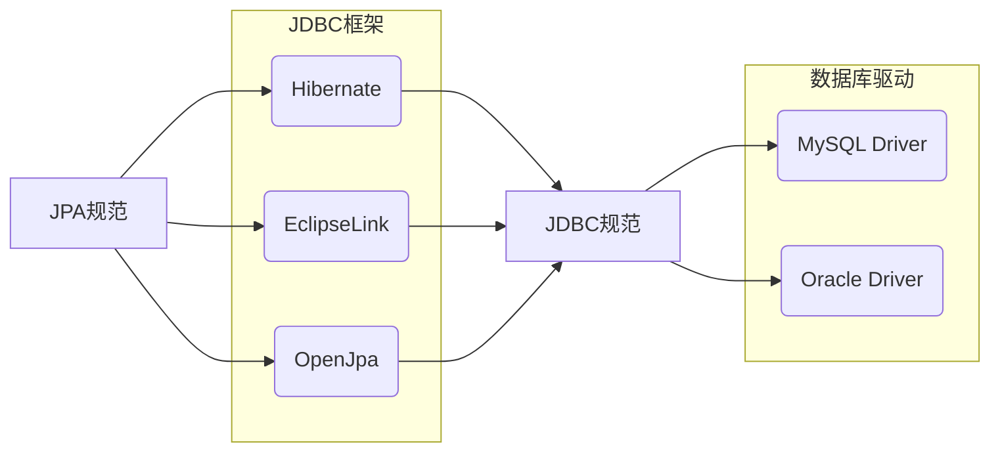

> JPA是Java Persistence API的简称，中文名Java持久层API，是JDK 5.0注解或XML描述对象－关系表的映射关系，并将运行期的实体对象持久化到数据库中。
> 
> Sun引入新的JPA ORM规范出于两个原因：其一，简化现有Java EE和Java SE应用开发工作；其二，Sun希望整合ORM技术，实现天下归一。
>
> ——摘自百度百科

# JPA是什么？

## JDBC的诞生

要说JPA，还要从JDBC说起。我们知道，JDBC是Java为规范数据库访问而推出的一套接口。

数据库的种类有很多，而每一套数据库都有自己的访问方法，如果不同的数据库，如MySQL、Oracle等都有自己的一套代码来访问，那显然是不太合理的，更换一套数据库就意味着需要更换整套代码。

于是，JDBC规范出现了，JDBC本身并不工作，而是定义了一套接口，各个数据库公司只需要负责实现JDBC提供的接口，这样一来，一套代码就可以实现访问不同的数据库了。

## JPA的诞生

JPA的出现也是类似，为了封装JDBC，很多公司制作了自己的框架，而这些框架同样有着自己的一套代码。

于是，JPA规范出现了。JPA只是定义了一套接口，其本身并不工作，而是让各个框架的公司负责实现JPA提供接口。这样一来，一套代码就可以实现不同的数据库框架，如Hibernate、EclipseLink、OpenJpa等。



# 如何使用JPA？

## 配置JPA

### 配置pom.xml

新建一个Maven工程，此处我们选用Hibernate实现JPA：

在pom.xml中引入必要的包：

- `hibernate-entitymanager`(Hibernate的JPA支持)
- `hibernate-c3po`(Hibernate连接池)
- `mysql-connector-java`(MySQL驱动)  
- 为了方便，引入junit、log4j、lombok
  
```xml
  <dependencies>
    <!-- https://mvnrepository.com/artifact/junit/junit -->
    <dependency>
      <groupId>junit</groupId>
      <artifactId>junit</artifactId>
      <version>4.12</version>
      <scope>test</scope>
    </dependency>

    <!-- https://mvnrepository.com/artifact/org.hibernate/hibernate-entitymanager -->
    <dependency>
      <groupId>org.hibernate</groupId>
      <artifactId>hibernate-entitymanager</artifactId>
      <version>5.4.10.Final</version>
    </dependency>

    <!-- https://mvnrepository.com/artifact/org.hibernate/hibernate-c3p0 -->
    <dependency>
      <groupId>org.hibernate</groupId>
      <artifactId>hibernate-c3p0</artifactId>
      <version>5.4.10.Final</version>
    </dependency>

    <!-- https://mvnrepository.com/artifact/log4j/log4j -->
    <dependency>
      <groupId>log4j</groupId>
      <artifactId>log4j</artifactId>
      <version>1.2.17</version>
    </dependency>

    <!-- https://mvnrepository.com/artifact/mysql/mysql-connector-java -->
    <dependency>
      <groupId>mysql</groupId>
      <artifactId>mysql-connector-java</artifactId>
      <version>8.0.19</version>
    </dependency>

    <!-- https://mvnrepository.com/artifact/org.projectlombok/lombok -->
    <dependency>
      <groupId>org.projectlombok</groupId>
      <artifactId>lombok</artifactId>
      <version>1.18.12</version>
      <scope>provided</scope>
    </dependency>
</dependencies>
```

### 配置persistence.xml

使用JPA，首先需要准备配置文件，其目录必须在`META-INF`文件夹中，如果是Maven工程，其目录就在`src/main/resources/META-INF`中。

在`src/main/resources/META-INF`中创建名为`persistence.xml`的配置文件，配置数据库的基本信息：

- `<persistence-unit>`标签代表一个数据库配置，其中transaction-type有两个选项：

  - RESOURCE_LOCAL  本地的，指只有一个数据库
  - JTA  分布式，指有多个数据库交互数据
  
- `<provider>`标签用于指定JPA接口的实现框架
  
- `<property>`标签中是一些数据库的基本配置，其中有一些特殊配置：
- hibernate.show_sql  控制台显示sql语句
  - hibernate.hbm2ddl.auto  设置访问数据库的操作，其中的value有三个选项：
    - create  每次访问数据库都删除原表，创建新表
    - update  如果数据库中表不存在就创建新表，否则访问该表
    - none  不创新新表

```xml
<?xml version="1.0" encoding="UTF-8"?>
<persistence xmlns="http://java.sun.com/xml/ns/persistence" version="2.0">
  <persistence-unit name="myJpa" transaction-type="RESOURCE_LOCAL">
    <provider>org.hibernate.jpa.HibernatePersistenceProvider</provider>
    <properties>
      <property name="javax.persistence.jdbc.user" value="root"/>
      <property name="javax.persistence.jdbc.password" value="root"/>
      <property name="javax.persistence.jdbc.driver" value="com.mysql.cj.jdbc.Driver"/>
      <property name="javax.persistence.jdbc.url" value="jdbc:mysql://localhost:3306/demo?useUnicode=true&amp;characterEncoding=UTF-8&amp;serverTimezone=UTC"/>

      <property name="hibernate.show_sql" value="true"/>
      <property name="hibernate.hbm2ddl.auto" value="update"/>
    </properties>
  </persistence-unit>
</persistence>
```

## 实现POJO类

接下来，要根据表的字段实现一个对象类，使类的属性和表的字段名一一对应。

原表共有两个字段，id int和name varchar(32)：

```shell
mysql> select * from user;
+----+-----------------+
| id | name            |
+----+-----------------+
|  1 | 冬马和纱        |
|  2 | 小木曾雪菜       |
+----+-----------------+
```

于是我们创建一个类，并通过注解配置Jpa：

- `@Entity`表示该对象成为被JPA管理的实体
- `@Table`指定数据表名
- `@Id`指定主键

- `@GenerateValue`指定自增方式，有四个选项：

  - `GenerationType.IDENTITY`  以自增主键的形式实现(仅支持有自增主键的数据库，如MySQL)
  - `GenerationType.SEQUENCE`  以序列的形式显示(如支持有序列的数据库，如Oracle)
  - `GenerationType.TABLE`  使用一个特定的数据表存储主键
  - `GenerationType.Auto`  主键由程序控制

- `@Column`指定该属性和数据库中字段的对应关系

```java
package org.koorye.pojo;

import lombok.Data;

import javax.persistence.*;

@Data
@Entity
@Table(name = "user")
public class User {
  @Id
  @GeneratedValue(strategy = GenerationType.IDENTITY)
  @Column(name = "id")
  private int userId;

  @Column(name = "name")
  private String userName;
}
```

需要说明，笔者偷懒使用Lombok的`@Data`注解自动生成GetSet和ToString方法，如果不使用该注解，请在类中写明GetSet和ToString方法。

## 调用JPA方法

到这里，JPA就可以使用了。

JPA方法分为7步：

- 创建`EntityManagerFactory`工厂类
- 通过工厂创建一个`EntityManager`
- 通过`EntityManager`得到一个事务
- 开启事务
- 调用JPA方法访问数据库
- 关闭事务
- 释放资源

先来简单体验一下：

```java
package org.koorye.test;

import org.junit.Test;
import org.koorye.pojo.User;

import javax.persistence.EntityManager;
import javax.persistence.EntityManagerFactory;
import javax.persistence.EntityTransaction;
import javax.persistence.Persistence;

public class JpaTest {
  @Test
  public void test() {
    EntityManagerFactory factory = Persistence.createEntityManagerFactory("myJpa");
    EntityManager manager = factory.createEntityManager();
    EntityTransaction transaction = manager.getTransaction();

    transaction.begin();
    User user = new User();
    user.setUserName("鹿目圆香");
    manager.persist(user);
    transaction.commit();

    manager.close();
    factory.close();
  }
}
```

运行结果：

```shell
Hibernate: insert into user (name) values (?)

Process finished with exit code 0
```

数据库：

```shell
mysql> select * from user;
+----+-----------------+
| id | name            |
+----+-----------------+
|  1 | 冬马和纱        |
|  2 | 小木曾雪菜      |
|  3 | 鹿目圆香        |
+----+-----------------+
3 rows in set (0.00 sec)
```

新字段成功添加！

### 关于EntityManager

EntityManager中有不同的方法，来实现不同的访问操作：

- persist  保存一个字段，如果该字段不存在则新增，如果存在则报错
- merge  更新一个字段，如果该字段不存在则新增，如果存在更新其内容
- remove  移除一个字段
- find  查找字段(立即加载)
- getReference  查找字段(延迟加载)
