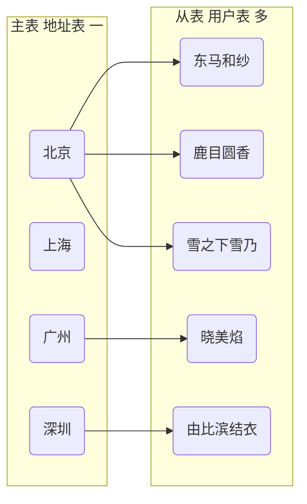
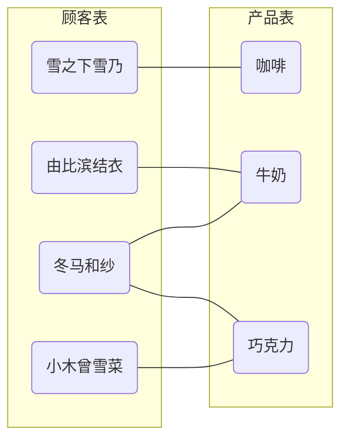

@[toc]

之前的所有操作都是在单表查询的前提下，这一期我们要了解Spring Data JPA多表查询的各种配置。

<!-- more -->

# 数据库表的关系

数据库表之间的关系可以分为一对一，一对多和多对多，其中一对一可以视为一对多的一种特殊情况。

## 一对多

所谓一对多关系，即第一个表中的单个行可以与第二个表中的一个或多个行相关，但第二个表中的一个行只可以与第一个表中的一个行相关。

一个简单的例子，如果有一个地址表和一个用户表，那么，一个用户只能有一个地址，而一个地址可以有一个、很多或没有用户。

在这个例子中，地址是一，用户则是多。

在MySQL中，我们通常把多的一方通过外键约束到一的一方的主键上。


```shell
# 地址表
+-------+--------+
| a_id  | a_name |
+-------+--------+
| 10001 | 北京   |
| 10002 | 上海   |
| 10003 | 广州   |
| 10004 | 深圳   |
+-------+--------+

# 用户表
+------+-----------------+--------------+
| u_id | u_name          | u_address_id |
+------+-----------------+--------------+
|    1 | 冬马和纱        |        10001 |
|    3 | 鹿目圆香        |        10001 |
|    4 | 晓美焰          |        10003 |
|    5 | 雪之下雪乃      |        10001 |
|   10 | 由比滨结衣      |        10004 |
+------+-----------------+--------------+

```

图解：



## 多对多

所谓一对多关系，即第一个表中的单个行可以与第二个表中的一个或多个行相关，第二个表中的单个行也可以与第二个表中的一个或多个行相关。

比如顾客和商品之间的关系：一个顾客可以购买很多商品，一种商品也可以被很多顾客购买。

要在MySQL中实现多对多关系，需要借助中间表实现。


```shell
# 顾客表
+------+-----------------+
| c_id | c_name          |
+------+-----------------+
|    1 | 冬马和纱        |
|    2 | 小木曾雪菜      |
|    3 | 雪之下雪乃      |
|    4 | 由比滨结衣      |
+------+-----------------+

# 产品表
+------+-----------+
| p_id | p_name    |
+------+-----------+
|    1 | 咖啡      |
|    2 | 牛奶      |
|    3 | 巧克力    |
+------+-----------+

# 中间表
+----------------+---------------+
| cp_customer_id | cp_product_id |
+----------------+---------------+
|              3 |             1 |
|              4 |             2 |
|              1 |             2 |
|              1 |             3 |
|              2 |             3 |
+----------------+---------------+
```

图解：



# Spring Data JPA实现一对多

## 基本配置

首先我们来实现上面一对多的例子，按照单表查询的规范，先配置好两个实体类和Dao接口：

User类：

```java
package org.koorye.pojo;

import lombok.AllArgsConstructor;
import lombok.Getter;
import lombok.NoArgsConstructor;
import lombok.Setter;

import javax.persistence.*;

@Getter
@Setter
@NoArgsConstructor
@AllArgsConstructor
@Entity
@Table(name = "user")
public class User {
  @Id
  @GeneratedValue(strategy = GenerationType.IDENTITY)
  @Column(name = "u_id")
  private int id;

  @Column(name = "u_name")
  private String name;

  @Override
  public String toString() {
    return "ID: " + id + ", Name: " + name;
  }
}
```

Address类：

```java
package org.koorye.pojo;

import lombok.*;

import javax.persistence.*;
import java.util.HashSet;
import java.util.Set;

@NoArgsConstructor
@AllArgsConstructor
@Getter
@Setter
@Entity
@Table(name = "address")
public class Address {
  @Id
  @Column(name = "a_id")
  private int id;

  @Column(name = "a_name")
  private String name;

  @Override
  public String toString() {
    return "ID: " + id + ", Name: " + name;
  }
}
```

UserDao接口：

```java
package org.koorye.dao;

import org.koorye.pojo.User;
import org.springframework.data.jpa.repository.JpaRepository;
import org.springframework.data.jpa.repository.JpaSpecificationExecutor;

public interface UserDao extends JpaRepository<User, Integer>, JpaSpecificationExecutor<User> {
}
```

AddressDao接口：

```java
package org.koorye.dao;

import org.koorye.pojo.Address;
import org.springframework.data.jpa.repository.JpaRepository;
import org.springframework.data.jpa.repository.JpaSpecificationExecutor;

public interface AddressDao extends JpaRepository<Address, Integer>, JpaSpecificationExecutor<Address> {
}
```

## 实现一对多

 Spring Data JPA为一对多提供了注解的解决方案：

- `@OneToMany(targetEitity = 对方实体类的字节码)`
- `@ManyToOne(targetEitity = 对方实体类的字节码)`
- `@JoinColumn(name = "自身表的外键", referencedColumnName = "对方表的主键")`

为了实现一对多关系，我们在主表的实体类中添加一个Set集合存储用户信息，然后在从表的实体类中添加一个Address表示地址。

接着，将注解添加到用户集合和地址上。

User类：

```java
public class User {
  @Id
  @GeneratedValue(strategy = GenerationType.IDENTITY)
  @Column(name = "u_id")
  private int id;

  @Column(name = "u_name")
  private String name;

  @ManyToOne(targetEntity = Address.class, cascade = CascadeType.ALL)
  @JoinColumn(name = "u_address_id", referencedColumnName = "a_id")
  private Address address;

  @Override
  public String toString() {
    return "ID: " + id + ", Name: " + name + ", Address: " + address.getName();
  }
}
```

Address类：

```java
public class Address {
  @Id
  @Column(name = "a_id")
  private int id;

  @Column(name = "a_name")
  private String name;

  @OneToMany(targetEntity = User.class, cascade = CascadeType.ALL)
  @JoinColumn(name = "u_address_id", referencedColumnName = "a_id")
  private Set<User> userSet = new HashSet<User>();

  @Override
  public String toString() {
    String str = ", Users: ";
    for (User user : userSet) {
      str = str.concat(user.getName() + ", ");
    }
    str = str.substring(0, str.length() - 2);
    return "ID: " + id + ", Name: " + name + str;
  }

```

此时笔者对User和Address类都配置了注解，**这意味着两个实体类对两表的关系都拥有维护权**。

让我们测试一个案例，从地址表中查询得到一个地址，赋给一个新增的用户：

在这里，我们可以通过User的`setAddress`方法设定地址，此处体现的是多对一的关系。

```java
  @Test
  @Transactional
  @Rollback(value = false)
  public void TestOneToMany() {
    Address address = addressDao.findByName("北京");
    User user = new User();
    user.setName("小木曾雪菜");
    user.setAddress(address);

    userDao.save(user);
  }
}
```

重新查表：

```shell
+------+-----------------+--------------+
| u_id | u_name          | u_address_id |
+------+-----------------+--------------+
|    1 | 冬马和纱        |        10001 |
|    3 | 鹿目圆香        |        10001 |
|    4 | 晓美焰          |        10003 |
|    5 | 雪之下雪乃      |        10001 |
|   10 | 由比滨结衣      |        10004 |
|   11 | 小木曾雪菜      |        10001 |
+------+-----------------+--------------+
```

新字段成功添加，Spring Data JPA自动根据得到的地址为新增用户分配了`u_address_id`.

同样的，由于配置了双向关系，我们也可以利用Address的`getUserSet`方法，再通过`UserSet.add`方法添加新用户。此处体现的是一对多的关系。

举例：

```java
  @Test
  @Transactional
  @Rollback(value = false)
  public void TestOneToMany() {
    Address address = addressDao.findByName("上海");
    User user = new User();
    user.setName("比企谷小町");
    address.getUserSet().add(user);

    userDao.save(user);
  }
}
```

查询结果：

```shell
+------+-----------------+--------------+
| u_id | u_name          | u_address_id |
+------+-----------------+--------------+
|    1 | 冬马和纱        |        10001 |
|    3 | 鹿目圆香        |        10001 |
|    4 | 晓美焰          |        10003 |
|    5 | 雪之下雪乃      |        10001 |
|   10 | 由比滨结衣      |        10004 |
|   11 | 小木曾雪菜      |        10001 |
|   12 | 比企谷小町      |        10002 |
+------+-----------------+--------------+
```

需要注意的是，如果同时使用`user.setAddress(address)`和`address.getUserSet().add(user)`方法，可能会导致**爆栈**！因此尽可能不要这样使用。

## 放弃维护权

刚才我们配置了双向关系，然而，在本例中，`user.setAddress`比`address.getUserSet().add`更加友好，我们可以通过放弃一对多关系的维护权来配置单向的多对一关系。

放弃一对多关系的维护权：

`@OneToMany(mapperBy = "对方表实体类指向该表实体类对应的属性名")`(当然`@ManyToOne`也一样)

放弃维护权之后，测试：

```java
  @Test
  @Transactional
  @Rollback(value = false)
  public void TestOneToMany() {
    Address address = addressDao.findByName("广州");
    User user = new User();
    user.setName("五更琉璃");
    address.getUserSet().add(user);

    userDao.save(user);
  }
}

```

查表：

```shell
+------+-----------------+--------------+
| u_id | u_name          | u_address_id |
+------+-----------------+--------------+
|    1 | 冬马和纱        |        10001 |
|    3 | 鹿目圆香        |        10001 |
|    4 | 晓美焰          |        10003 |
|    5 | 雪之下雪乃      |        10001 |
|   10 | 由比滨结衣      |        10004 |
|   11 | 小木曾雪菜      |        10001 |
|   12 | 比企谷小町      |        10002 |
|   13 | 五更琉璃        |         NULL |
+------+-----------------+--------------+
```

新字段的`u_address_id`被置为`NULL`，外联关联失败！

然而，多对一关系的维护权仍然是生效的：

```java
  @Test
  @Transactional
  @Rollback(value = false)
  public void TestOneToMany() {
    Address address = addressDao.findByName("广州");
    User user = userDao.findByName("五更琉璃");
    user.setAddress(address);

    userDao.save(user);
  }
```

查表：

```shell
+------+-----------------+--------------+
| u_id | u_name          | u_address_id |
+------+-----------------+--------------+
|    1 | 冬马和纱        |        10001 |
|    3 | 鹿目圆香        |        10001 |
|    4 | 晓美焰          |        10003 |
|    5 | 雪之下雪乃      |        10001 |
|   10 | 由比滨结衣      |        10004 |
|   11 | 小木曾雪菜      |        10001 |
|   12 | 比企谷小町      |        10002 |
|   13 | 五更琉璃        |        10003 |
+------+-----------------+--------------+
```

新用户的`u_address_id`字段设置成功。

# Spring Data JPA实现多对多

Spring Data JPA同样为我们提供了多对多的注解方案。

## 基本配置

同样我们先配置好Customer类和Product类，并提供CustomerDao和ProductDao接口。

Customer类：

```java
package org.koorye.pojo;

import lombok.Getter;
import lombok.NoArgsConstructor;
import lombok.Setter;

import javax.persistence.*;

@NoArgsConstructor
@Getter
@Setter
@Entity
@Table(name = "customer")
public class Customer {
  @Id
  @GeneratedValue(strategy = GenerationType.IDENTITY)
  @Column(name = "c_id")
  private int id;

  @Column(name = "c_name")
  private String name;

  @Override
  public String toString() {
    return "ID: " + id + ", Name: " + name;
  }
}
```

Product类：

```java
package org.koorye.pojo;

import lombok.Getter;
import lombok.NoArgsConstructor;
import lombok.Setter;

import javax.persistence.*;

@NoArgsConstructor
@Getter
@Setter
@Entity
@Table(name = "product")
public class Product {
  @Id
  @GeneratedValue(strategy = GenerationType.IDENTITY)
  @Column(name = "p_id")
  private int id;

  @Column(name = "p_name")
  private String name;

  @Override
  public String toString() {
    return "ID: " + id + ", Name: " + name;
  }
}

```

CustomerDao接口：

```java
package org.koorye.dao;

import org.koorye.pojo.Customer;
import org.springframework.data.jpa.repository.JpaRepository;
import org.springframework.data.jpa.repository.JpaSpecificationExecutor;

public interface CustomerDao extends JpaRepository<Customer, Integer>, JpaSpecificationExecutor<Customer> {
}
```

ProductDao接口：

```java
package org.koorye.dao;

import org.koorye.pojo.Product;
import org.springframework.data.jpa.repository.JpaRepository;
import org.springframework.data.jpa.repository.JpaSpecificationExecutor;

public interface ProductDao extends JpaRepository<Product, Integer>, JpaSpecificationExecutor<Product> {
}
```

## 实现多对多

既然是多对多，那么两边都要使用Set的形式配置。

接着，Spring Data JPA为多对多关系提供了两个注解：

- `@ManyToMany(targetEntity = 对方实体类的字节码)`  映射多对多关系

- `@JoinTable(name = "中间表名称", `
                       `joinColumns = {@JoinColumn(name = "中间表对应自身表的外键", `
                                                                           `referencedColumnName = "自身表的主键")}, `
                       `inverJoinColumns = {@JoinColumn(name = "中间表对应对方表的外键", `
                                                                             `	referencedColumnName = "外方表的主键")})`

写的有些乱，让我们看一下例子：

Customer类：

```java
public class Customer {
  @Id
  @GeneratedValue(strategy = GenerationType.IDENTITY)
  @Column(name = "c_id")
  private int id;

  @Column(name = "c_name")
  private String name;

  @ManyToMany(targetEntity = Product.class)
  @JoinTable(name = "customer__product",
      joinColumns = {@JoinColumn(name = "cp_customer_id", referencedColumnName = "c_id")},
      inverseJoinColumns = {@JoinColumn(name = "cp_product_id", referencedColumnName = "p_id")})
  private Set<Product> productSet;

  @Override
  public String toString() {
    return "ID: " + id + ", Name: " + name;
  }
}
```

Product类：

```java
public class Product {
  @Id
  @GeneratedValue(strategy = GenerationType.IDENTITY)
  @Column(name = "p_id")
  private int id;

  @Column(name = "p_name")
  private String name;

  @ManyToMany(targetEntity = Customer.class)
  @JoinTable(name = "customer__product",
      joinColumns = {@JoinColumn(name = "cp_product_id", referencedColumnName = "p_id")},
      inverseJoinColumns = {@JoinColumn(name = "cp_customer_id", referencedColumnName = "c_id")})
  private Set<Customer> customerSet;

  @Override
  public String toString() {
    return "ID: " + id + ", Name: " + name;
  }
}
```

案例，给一个已有顾客添加一个已有商品：

```java
  @Test
  @Transactional
  @Rollback(value = false)
  public void TestManyToMany() {
    Customer customer = customerDao.findByName("小木曾雪菜");
    Product product = productDao.findByName("咖啡");
    customer.getProductSet().add(product);
    customerDao.save(customer);
  }
}
```

查表：

```shell
+----------------+---------------+
| cp_customer_id | cp_product_id |
+----------------+---------------+
|              3 |             1 |
|              4 |             2 |
|              1 |             2 |
|              1 |             3 |
|              2 |             3 |
|              2 |             1 |
+----------------+---------------+
```

新字段成功添加。

案例，查询用户购买的商品：

```java
  @Test
  @Transactional
  @Rollback(value = false)
  public void TestManyToMany() {
    Customer customer = customerDao.findByName("冬马和纱");
    Set<Product> productSet = customer.getProductSet();
    for (Product product : productSet) {
      System.out.println(product);
    }
  }
}
```

输出结果：

```shell
Hibernate: select customer0_.c_id as c_id1_0_, customer0_.c_name as c_name2_0_ from customer customer0_ where customer0_.c_name=?
Hibernate: select productset0_.cp_customer_id as cp_custo2_1_0_, productset0_.cp_product_id as cp_produ1_1_0_, product1_.p_id as p_id1_2_1_, product1_.p_name as p_name2_2_1_ from customer__product productset0_ inner join product product1_ on productset0_.cp_product_id=product1_.p_id where productset0_.cp_customer_id=?
ID: 3, Name: 巧克力
ID: 2, Name: 牛奶

Process finished with exit code 0
```

多对多同样支持放弃维护权，本文不再演示。

# 级联

级联是Spring Data JPA提供的强大功能，指多个对象之间的映射关系，建立数据之间的级联关系提高管理效率：

- 级联插入  插入两条关联的记录时，插入其中一条，另一条也会自动插入
- 级联删除  删除一条记录时，其他表中和该记录有关的记录也会自动删除

级联的配置非常简单，只需要在`@OneToMany` / `@ManyToOne` / `@ManyToMany`中配置`cascade = CascadeType.All`即可，指所有操作都进行级联。

除外还有：

- `CascadeType.PERSIST`  保存时级联
- `CascadeType.MERGE`  更新时级联
- `CascadeType.ROMOVE`  删除时更新
- ...

案例，添加一个新顾客和一个新商品，并给新顾客添加该新商品：

```java
  @Test
  @Transactional
  @Rollback(value = false)
  public void TestManyToMany() {
    Customer customer = new Customer();
    customer.setName("鹿目圆香");

    Product product = new Product();
    product.setName("猫");

    Set<Product> productSet = new HashSet<>();
    productSet.add(product);
    customer.setProductSet(productSet);

    customerDao.save(customer);
  }
```

查表：

```shell
mysql> select * from customer;
+------+-----------------+
| c_id | c_name          |
+------+-----------------+
|    1 | 冬马和纱        |
|    2 | 小木曾雪菜      |
|    3 | 雪之下雪乃      |
|    4 | 由比滨结衣      |
|    5 | 鹿目圆香        |
+------+-----------------+
5 rows in set (0.01 sec)

mysql> select * from product;
+------+-----------+
| p_id | p_name    |
+------+-----------+
|    1 | 咖啡      |
|    2 | 牛奶      |
|    3 | 巧克力    |
|    4 | 猫        |
+------+-----------+
4 rows in set (0.00 sec)

mysql> select * from customer__product;
+----------------+---------------+
| cp_customer_id | cp_product_id |
+----------------+---------------+
|              3 |             1 |
|              4 |             2 |
|              1 |             2 |
|              1 |             3 |
|              2 |             3 |
|              2 |             1 |
|              5 |             4 |
+----------------+---------------+
7 rows in set (0.01 sec)
```

新字段成功添加并关联。