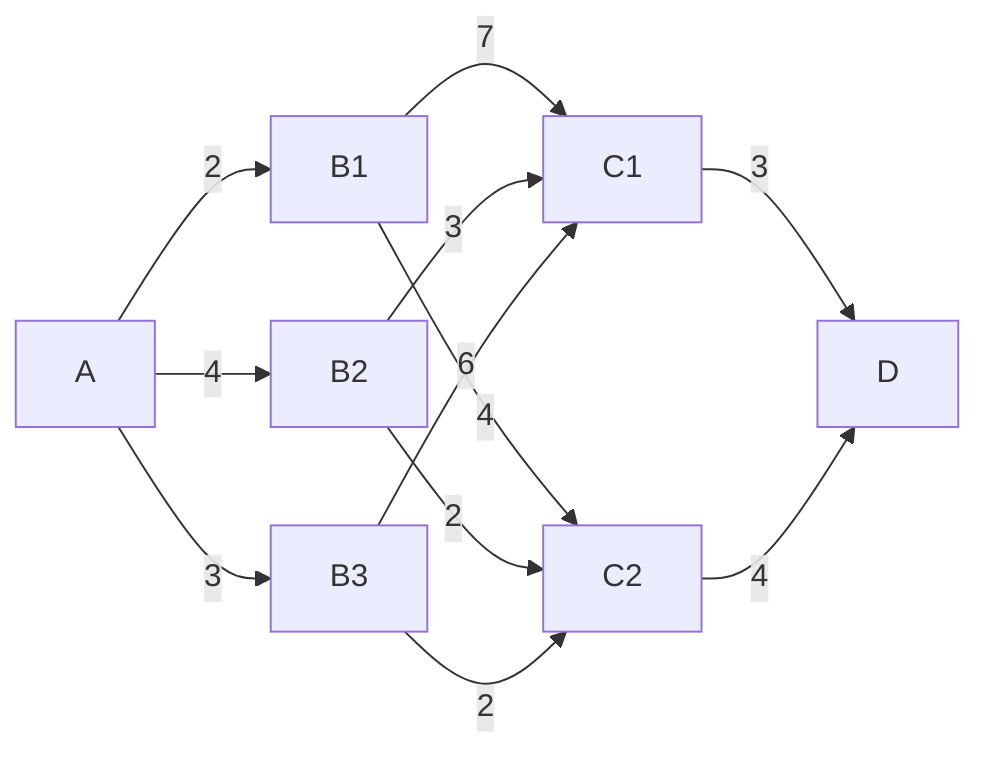

# 04. 动态规划

## 定义

动态规划是运筹学的一个分支，是求解决策过程最优化的数学方法。

动态规划是求解某类问题的一种方法，而不是一种特殊算法，没有标准的数学表达式和明确定义的一组规则。

动态规划的基本概念有：

- 阶段：对整个过程的自然划分，阶段变量一般用 $k=1,2,\dots,n$ 表示；

- 状态：每个阶段开始时过程所处的自然状况，用 $x_k$ 表示第 $k$ 阶段的状态变量，用 $X_k$ 表示第 $k$ 阶段的允许状态集合；

- 决策：一个阶段的状态确定后，作出各种选择从而演变到下一阶段的某个状态，用 $u_k(x_k)$​ 表示第 $k$​ 阶段处于状态 $x_k$​ 时的决策变量，用 $U_k(x_k)$ 表示 $x_k$ 的允许决策集合；

- 策略：决策组成的序列。由第 $k$ 到第 $j$​ 阶段的子过程策略记
  $$
  p_{kj}(x_k)=\{u_k(x_k),\dots,u_j(x_j)\}
  $$

- 状态转移方程：表示状态和决策确定下一状态的演变规律，记
  $$
  x_{k+1}=T_k(x_k,u_k),k=1,2,\dots,n
  $$

- 指标函数：衡量过程优劣的数量指标，记
  $$
  V_{k,n}(x_k,u_k,x_{k+1},\dots,x_{n+1})
  $$

- 最优值函数：使指标函数达到最优，记
  $$
  f_k(x_k)=\text{opt}V_{k,n}(x_k,p_{kn})
  $$
  其中 $\text{opt}$ 可取 $\max$ 或 $\min$。

如果一个问题能用动态规划方法求解，可以按下列步骤建立动态规划的数学模型：

1. 将过程划分成恰当的阶段；
2. 正确选择状态变量 $x_k$，确定允许状态集合 $X_k$；
3. 选择决策变量 $u_k$，确定允许决策集合 $U_k(x_k)$；
4. 写出状态转移方程；
5. 确定阶段指标；
6. 写出基本方程。

## 典型问题

### 最短路线问题

状态：各段的初始位置 $x_k$；

决策：各个状态出发的走向 $x_{k+1}=u_k(x_k)$；

阶段指标：相邻两段状态间的距离 $d_k(x_k,u_k(x_k))$；

指标函数：阶段指标之和；

最优值函数：由 $x_k$​ 出发到终点的最短距离。

于是有基本方程：
$$
f_k(x_k)=\min_{u_k(x_k)}[d_k(x_k,u_k(x_k))+f_{k+1}(x_{k+1})],
$$

$$
f_{n+1}(x_{n+1})=0,k=n,\dots,1
$$

利用该模型就可以算出最短路线。

#### 例子

对于下图

可将其阶段划分为 $k=1,2,3,4$。

- $k=1$ 时，有允许状态集合 $X_1=\{A\}$；
- $k=2$ 时，有允许状态集合 $X_2=\{B_1,B_2,B_3\}$；
- $k=3$ 时，有允许状态集合 $X_3=\{C_1,C_2\}$；
- $k=4$ 时，有允许状态集合 $X_4=\{D\}$；

进行逆序求解，令

$$
f_4(D)=0
$$

则有

$$
f_k(x_k)=\min_{u_k(x_k)}[d(x_k,u_k(x_k))+f_{k+1}(x_{k+1})]
$$

于是有

- $k=4$ 时：
  $$
  f_4(D)=0
  $$
  
- $k=3$​ 时：
  $$
  f_3(C_1)=d(C_1,D)+f_4(D)=3,
  $$
  
  $$
  f_3(C_2)=d(C_2,D)+f_4(D)=4.
  $$
  
   
  
- $k=2$ 时：
  $$
  f_2(B_1)=\min_{i}[d(B_1,C_i)+f_3(C_i)]=d(B_1,C_2)+f_3(C_2)=8,
  $$

  $$
  f_2(B_2)=\min_{i}[d(B_2,C_i)+f_3(C_i)]=d(B_2,C_1)+f_3(C_1)=6,
  $$

  $$
  f_2(B_3)=\min_{i}[d(B_3,C_i)+f_3(C_i)]=d(B_3,C_2)+f_3(C_2)=6.
  $$

- $k=1$ 时：
  $$
  f_1(A)=\min_{i}[d(A,B_i)+f_2(B_i)]=d(A,B_3)+f_2(B_3)=9.
  $$

因此可得最短距离为 9，最短路径为
$$
A\to B_3\to C_2\to D
$$

### 生产计划问题

阶段：自然时间；

状态：每阶段开始时的存储量 $x_k$；

决策：每个阶段的产量 $u_k$；

状态转移方程：
$$
x_{k+1}=x_k+u_k-d_k
$$
其中 $d_k$ 为每个阶段的需求量；

阶段指标：阶段的生产成本和储存费之和，设每阶段开工成本为 $a$，生产单位数量产品成本为 $b$，每阶段单位数量产品储存费为 $c$，即
$$
v_k(x_k,u_k)=cx_k+\left\{\begin{aligned}
&a+bu_k,u_k>0\\
&0
\end{aligned}\right.
$$
指标函数：阶段指标之和；

最优值函数：从状态 $x_k$ 出发到过程终结的最小费用，即
$$
f_k(x_k)=\min_{u_k}[v_k(x_k,u_k)+f_{f+1}(x_{k+1})],
$$

$$
f_{n+1}(x_{n+1}^0)=0,k=n,\dots,1.
$$

其中 $x_{n+1}^0$ 表示过程终结时允许的存储量。

根据上述模型可解。