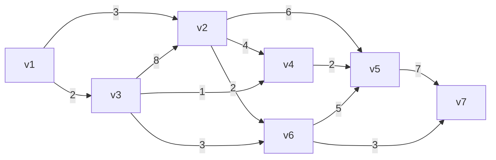

# 05. 图与网络

## 基本概念

- 无向图：一个非空有限集合 $V(G)$ 和 $V(G)$ 中的某些元素的无序对集合 $E(G)$​ 构成的二元组，记
  $$
  G=(V(G),E(G))
  $$
  其中
  $$
  V(G)=\{v_1,v_2,\dots,v_n\}
  $$
  称顶点集或结点集，
  $$
  E(G)=\{e1,e2,\dots,e_m\}
  $$
  称边集，$E(G)$​ 中的每个元素 $e_k$​ 为 $V(G)$​ 中某两个元素 $v_i,v_j$ 的无序对，记
  $$
  e_k=(v_i,v_j)\ 或\ e_k=v_iv_j=v_jv_i
  $$
  称从 $v_i$​ 到 $v_j$ 的边；

  - 有限图：结点集和边集都有限的图；
  - 简单图：没有环也没有两条边连接同一对结点。

- 有向图：一个有向图 $G$ 由一个非空有限集合 $V$ 和 $V$ 中的某些元素的有序对集合 $A$ 构成二元组，记
  $$
  G=(V,A)
  $$
  其中 
  $$
  V=\{v1,v2,\dots,v_n\}
  $$
  称顶点集或结点集，
  $$
  A=\{a_1,a_2,\dots,a_m\}
  $$
  称弧集，$A$ 中的每个元素 $a_k$ 为 $V$ 中某两个元素的有序对，记 
  $$
  a_k=(v_i,v_j)
  $$
  称从 $v_i$ 到 $v_j$ 的弧；

- 完全图：每一对不同的顶点都有一条边相连的简单图；

- 子图：如果 $V(H)\sub V(G),E(H)\sub E(G)$​，称 $H$​ 是 $G$​ 的子图，$G$ 是 $H$​ 的母图；

- 结点的度：设 $v\in V(G)$，$G$ 中与 $v$ 关联的边数称 $v$ 的度，记 $d(v)$。​

## 问题求解

### 最短路

对于给定的赋权图 $G=(V,E,W)$，其中 $V$ 为结点集，$E$​ 为边集，邻接矩阵 $W=(w_{ij})_{n\cp n}$，其中
$$
w_{ij}=\left\{\begin{aligned}
&v_i,v_j\text{之间边的权值},&v_i,v_j\text{之间有边}, \\
&\infty,&v_i,v_j\text{之间无边}.
\end{aligned}\right.
$$

$$
w_{ii}=0,i=1,2,\dots,n
$$

#### 固定起点 Dijkstra 算法

$u_0$ 为 $V$ 中某个固定起点，求 $u_0$ 到 $V$ 中另一顶点 $v_0$ 的最短距离和最短路径。

Dijkstra 的步骤：

1. 为每个结点维护：

   - $l(v)$: ​表示起点到结点 $v$ 的长度；
   - $z(v)$: 表示结点 $v$ 的父结点。

2. 令 $l(u_0)=0$，对 $v\ne u_0$，令
   $$
   l(v)=\infty,z(v)=u_0,S_0={u_0},i=0.
   $$

3. 对每个 $v\notin S_i$，令
   $$
   l(v)=\min_u[l(v),l(u)+w(uv)],
   $$
   若此次迭代利用结点 $\hat{u}$​ 修改了 $l(v)$，则 $z(v)=\hat{u}$，否则不变；

4. 将结点 $\underset{v}{\text{argmin}}[l(v)]$ 加入 $S_i$，构成新的集合；
   
5. 若 $i=|V|-1$ 或 $v_0$ 进入 $S_i$​，算法终止；否则转步骤 3。

#### 每对结点 Floyd 算法

Floyd 算法：

对于赋权图 $G=(V,E,A_0)$​​，对于邻接矩阵：
$$
A_0=\begin{pmatrix}
a_{11}&a_{12}&\dots&a_{1n}\\
a_{21}&a_{22}&\dots&a_{2n}\\
\vdots&\vdots&\ddots&\vdots\\
a_{n1}&a_{n2}&\dots&a_{nn}\\
\end{pmatrix}
$$
有迭代公式：
$$
a_k(i,j)=\min[a_{k-1}(i,j),a_{k-1}(i,k)+a_{k-1}(k,j)]
$$
其中 $k$ 是迭代次数。

如果要求得最短路径，还需引入路由矩阵
$$
R_k=(r_k(i,j))_{n\cp n}
$$

- 初始时
  $$
  R_0=O_{n\cp n}
  $$

- 迭代公式为
  $$
  R_k=(r_k(i,j))_{n\cp n}
  $$
  其中
  $$
  r_k(i,j)=\left\{\begin{aligned}
  &k,a_{k-1}(i,j)>a_{k-1}(i,k)+a_{k-1}(k,j),\\
  &r_{k-1}(i,j),Others.
  \end{aligned}\right.
  $$
  

### 最小生成树

在赋权图 $G$ 中，边权之和最小的生成树称最小生成树。

#### Kruskal 算法

步骤：

1. 初始化 $E'=\varnothing$​；
2. 每次从 $E-E’$​ 中选取一条边，加入 $E'$，要求使得 $E'$​​​​ 不构成圈的边中权值最小；
3. 直到选取 $n-1$ 个边为止 $(n 为结点个数)$。

#### Prime 算法

步骤：

1. 初始化 $P=\{v_1\},Q=\varnothing$​​；

2. 每次找最短边 $pv$，其中  $p\in P,v\in V-P$，使
   $$
   P=P+\{v\},Q=Q+\{pv\}.
   $$

3. 直到 $P$ 中包含所有结点。

### 最大流

给定有向图 $D=(V,A)$​​，在 $V$​ 中指定发点 (源) $v_s$​ 和收点 (汇) $v_t$​。对于每一条弧，对应有一个 $c(v_i,v_j)\ge0$​ 称容量，构成一个网络记 
$$
D=(V,A,C)
$$
其中 $C=\{c_{ij}\}$。

满足下列条件的流 $f$ 称可行流：

- 容量限制：对每一弧 $(v_i,v_j)\in A$，$0\le f_{ij}\le c_{ij}$；

- 平衡：
  $$
  \sum_{j:(v_i,v_j)\in A}f_{ij}-\sum_{j:(v_i,v_j)\in A}f_{ji}=\left\{\begin{aligned}
  v,i=s,\\
  -v,i=t,\\
  0,i\ne s,t.
  \end{aligned}\right.
  $$
  即，发点的流出为 $v$，收点的流入为 $v$，其余点流出量=流入量。

根据上述条件，可以构造线性规划模型
$$
\max v,
$$

$$
s.t.\left\{\begin{aligned}
&\sum_{j:(v_i,v_j)\in A}f_{ij}-\sum_{j:(v_i,v_j)\in A}f_{ji}=\left\{\begin{aligned}
v,i=s,\\
-v,i=t,\\
0,i\ne s,t,
\end{aligned}\right.\\
&0\le f_{ij}\le c_{ij}.
\end{aligned}\right.
$$

不过对于图论模型，有效率更高的解决方法。

#### Ford-Fulkerson 算法

步骤：

1. 初始化一个残差网络，与原网络相同，为每条弧 $a_i$​​​ 初始化空闲流量 (即未使用的流量) $r(a_i)=c(a_i)$​​​，其中 $c(a_i)$​​​​ 为容量；

2. 找到一个从发点到收点的路径，记经过的弧集
   $$
   A'=\{a_1',a_2',\dots,a_m'\}
   $$
   取空闲流量最小值作为路径的流量，对每条弧更新空闲流量
   $$
   r(a_i')=r(a_i')-\min_{i=1}^m r(a_i').
   $$

3. 对找到的路径生成反向路径，记经过的弧集
   $$
   A''=\{a_m'',a_{m-1}'',\dots,a_1''\}
   $$
   其中 $a_i''$ 即为 $a_i'$ 的反向弧，每条弧的空闲流量即为之前的正向路径扣除的流量
   $$
   r(a_i'')=\min_{i=1}^mr(a_i').
   $$

4. 合并相同方向的弧，使它们的空闲流量相加；

5. 直到找不到发点到收点的路径，迭代结束，否则转步骤 2；

6. 令初始网络的每条弧的容量 $c(a_i)$ 与迭代后的残差网络对应的弧的闲流量 $r(a_i)$ 相减，即为该条弧的流量
   $$
   f(a_i)=c(a_i)-r(a_i).
   $$

## Networkx 包

networkx 是一个用 Python 开发的图论与复杂网络建模工具，内置常用的图与复杂网络的分析算法。

常用函数如下：

- `Graph()`: 创建无向图；
- `DiGraph()`: 创建有向图；
- `add_edge()`：加边；
- `add_edge_from()`：加多条边；
- `add_node()`：加结点；
- `add_node_from()`：加多个结点；
- `dijkstra_path()`：求最短路径；
- `dijkstra_path_length()`：求最短距离。

### 画图

对于邻接矩阵表示的无向图：
$$
A=\begin{pmatrix}
0&9&2&4&7\\
9&0&3&4&0\\
2&3&0&8&4\\
4&4&8&0&6\\
7&0&4&6&0
\end{pmatrix}
$$
画图代码如下：

```python
# %%

import numpy as np
import networkx as nx

# %%

A = np.array([[0, 9, 2, 4, 7],
              [9, 0, 3, 4, 0],
              [2, 3, 0, 8, 4],
              [4, 4, 8, 0, 6],
              [7, 0, 4, 6, 0]])
G = nx.Graph(A)

# %%

pos=nx.spring_layout(G, iterations=20)

nx.draw_networkx(G, pos=pos)
nx.draw_networkx_edge_labels(G,pos=pos,
                             edge_labels=nx.get_edge_attributes(G, 'weight'))
```

输出如下：


### 求最短路

对下图：



#### 固定起点

求解 $v_1$​ 到其余所有结点的最短路和最短距离，代码如下：

```python
# %%

import numpy as np
import networkx as nx

# %%

G = nx.DiGraph()
G.add_weighted_edges_from([
    ('v1', 'v2', 3),
    ('v1', 'v3', 2),
    ('v2', 'v4', 4),
    ('v2', 'v5', 6),
    ('v2', 'v6', 2),
    ('v3', 'v2', 8),
    ('v3', 'v4', 1),
    ('v3', 'v6', 3),
    ('v4', 'v5', 2),
    ('v6', 'v5', 5),
    ('v5', 'v7', 7),
    ('v6', 'v7', 3),
])

# %%

path = nx.dijkstra_path(G, source='v1',
                        target='v7',
                        weight='weight')
dist = nx.dijkstra_path_length(G, source='v1',
                               target='v7',
                               weight='weight')

path, dist
```

输出如下：

```python
(['v1', 'v3', 'v6', 'v7'], 8)
```

于是有，最短路径为 $v_1\to v_3\to v_6\to v_7$，最短距离为 8。

#### 每对结点

对于上述问题，求解任意每对结点间的最短距离和路径，代码如下：

```python
# %%

import numpy as np
import networkx as nx

# %%

G = nx.DiGraph()
G.add_weighted_edges_from([
    ('v1', 'v2', 3),
    ('v1', 'v3', 2),
    ('v2', 'v4', 4),
    ('v2', 'v5', 6),
    ('v2', 'v6', 2),
    ('v3', 'v2', 8),
    ('v3', 'v4', 1),
    ('v3', 'v6', 3),
    ('v4', 'v5', 2),
    ('v6', 'v5', 5),
    ('v5', 'v7', 7),
    ('v6', 'v7', 3),
])

# %%

path = nx.shortest_path(G, weight='weight')
length = nx.shortest_path_length(G, weight='weight')
dict(path), dict(length)
```

输出如下：

```python
({'v1': {'v1': ['v1'],
   'v2': ['v1', 'v2'],
   'v3': ['v1', 'v3'],
   'v4': ['v1', 'v3', 'v4'],
   'v6': ['v1', 'v3', 'v6'],
   'v5': ['v1', 'v3', 'v4', 'v5'],
   'v7': ['v1', 'v3', 'v6', 'v7']},
  'v2': {'v2': ['v2'],
   'v4': ['v2', 'v4'],
   'v5': ['v2', 'v5'],
   'v6': ['v2', 'v6'],
   'v7': ['v2', 'v6', 'v7']},
  'v3': {'v3': ['v3'],
   'v2': ['v3', 'v2'],
   'v4': ['v3', 'v4'],
   'v6': ['v3', 'v6'],
   'v5': ['v3', 'v4', 'v5'],
   'v7': ['v3', 'v6', 'v7']},
  'v4': {'v4': ['v4'], 'v5': ['v4', 'v5'], 'v7': ['v4', 'v5', 'v7']},
  'v5': {'v5': ['v5'], 'v7': ['v5', 'v7']},
  'v6': {'v6': ['v6'], 'v5': ['v6', 'v5'], 'v7': ['v6', 'v7']},
  'v7': {'v7': ['v7']}},
 {'v1': {'v1': 0, 'v3': 2, 'v2': 3, 'v4': 3, 'v6': 5, 'v5': 5, 'v7': 8},
  'v2': {'v2': 0, 'v6': 2, 'v4': 4, 'v7': 5, 'v5': 6},
  'v3': {'v3': 0, 'v4': 1, 'v6': 3, 'v5': 3, 'v7': 6, 'v2': 8},
  'v4': {'v4': 0, 'v5': 2, 'v7': 9},
  'v5': {'v5': 0, 'v7': 7},
  'v6': {'v6': 0, 'v7': 3, 'v5': 5},
  'v7': {'v7': 0}})
```

可以发现，如 $v_1$ 到 $v_7$​ 的最短距离为 8，最短路径为 $v_1\to v_3\to v_6\to v_7$​，与之前的结论相同，其余结点间也可以查阅。

### 求最小生成树

对画图示例的邻接矩阵求最小生成树，代码如下：

```python
# %%

import numpy as np
import networkx as nx

# %%

A = np.array([[0, 9, 2, 4, 7],
              [9, 0, 3, 4, 0],
              [2, 3, 0, 8, 4],
              [4, 4, 8, 0, 6],
              [7, 0, 4, 6, 0]])
G = nx.Graph(A)

# %%

T = nx.minimum_spanning_tree(G)

# %%

pos=nx.spring_layout(T, iterations=20)

nx.draw_networkx(T, pos=pos)
nx.draw_networkx_edge_labels(T,pos=pos,
                             edge_labels=nx.get_edge_attributes(T, 'weight'))
```

输出如下：


### 求最大流

 对于求最短路的示例，将权值看作容量，求 $v_1$ 到 $v_7$ 的最大流，代码如下：

```python
# %%

import numpy as np
import networkx as nx

# %%

G = nx.DiGraph()

edge_list = [
    ('v1', 'v2', 3),
    ('v1', 'v3', 2),
    ('v2', 'v4', 4),
    ('v2', 'v5', 6),
    ('v2', 'v6', 2),
    ('v3', 'v2', 8),
    ('v3', 'v4', 1),
    ('v3', 'v6', 3),
    ('v4', 'v5', 2),
    ('v6', 'v5', 5),
    ('v5', 'v7', 7),
    ('v6', 'v7', 3),
]

for edge in edge_list:
    G.add_edge(edge[0], edge[1], capacity=edge[2])

# %%

value, flow_dic = nx.maximum_flow(G, 'v1', 'v7')

# %%

value, flow_dic

# %%

dic = {}
for s in flow_dic:
    for t in flow_dic[s]:
        dic[(s,t)] = flow_dic[s][t]

pos = nx.spring_layout(G)
nx.draw_networkx(G, pos=pos)
nx.draw_networkx_edge_labels(T,pos=pos,
                             edge_labels=dic)
```

输出如下：

```python
(5,
 {'v1': {'v2': 3, 'v3': 2},
  'v2': {'v4': 0, 'v5': 3, 'v6': 0},
  'v3': {'v2': 0, 'v4': 0, 'v6': 2},
  'v4': {'v5': 0},
  'v5': {'v7': 3},
  'v6': {'v5': 0, 'v7': 2},
  'v7': {}})
```


最大流为 5，并给出具体流向和流量。
e, flow_dic

# %%

dic = {}
for s in flow_dic:
    for t in flow_dic[s]:
        dic[(s,t)] = flow_dic[s][t]

pos = nx.spring_layout(G)
nx.draw_networkx(G, pos=pos)
nx.draw_networkx_edge_labels(T,pos=pos,
                             edge_labels=dic)
```

输出如下：

```python
(5,
 {'v1': {'v2': 3, 'v3': 2},
  'v2': {'v4': 0, 'v5': 3, 'v6': 0},
  'v3': {'v2': 0, 'v4': 0, 'v6': 2},
  'v4': {'v5': 0},
  'v5': {'v7': 3},
  'v6': {'v5': 0, 'v7': 2},
  'v7': {}})
```

[外链图片转存中...(img-CFykI3AE-1627132572853)]

最大流为 5，并给出具体流向和流量。