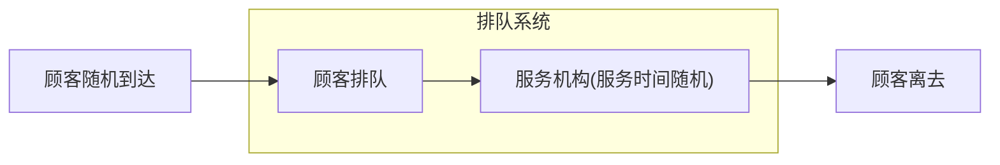
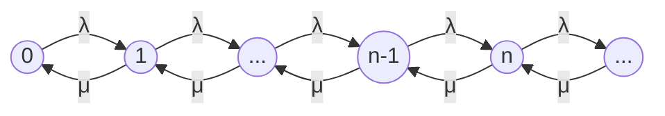

# 06. 排队论

## 定义

排队论也称随机服务系统理论，它研究的内容有三部分：

- 形态问题：各种排队系统的概率规律性，如队长分布、等待时间分布、忙期分布等；
- 最优化问题：分静态最优 (最优设计) 和动态最优 (最优运营)；
- 排队系统的统计推断：判断一个给定的排队系统符合于哪种模型。

排队论的一般模型如图：

一般的排队过程由三部分组成：

- **输入过程**：顾客到来时间的规律性；
  - 顾客组成可能**有限**或**无限**；
  - 顾客到达可能**逐个**或**成批**；
  - 顾客到达可以是**相互独立**或**相关**；
  - 输入过程可以**平稳 (与时间无关)** 或**非平稳**。
- **排队规则**：顾客按怎样的规则排队等待；
  - **损失制 (消失制)**：顾客到达时所有服务台均被占用，顾客随机离去；
  - **等待制**：顾客到达时所有服务台均被占用，顾客排队等待，直到接受完服务才离去；
  - 混合制：既有等待又有损失，有**队列长度有限**和**排队等待时间有限**两种情况。
- **服务过程**：
  - 先到先服务；
  - 后到先服务；
  - 随机服务；
  - 优先服务。

排队模型用六个符号表示：$X/Y/Z/A/B/C$

- $X$ 表示顾客到达流或顾客到达间隔时间分布；
- $Y$ 表示服务时间分布；
- $Z$ 表示服务台数目；
- $A$ 表示系统容量限制；
- $B$ 表示顾客源数目；
- $C$ 表示服务规则。

如略去后三项，即指 $X/Y/Z/\infty/\infty/FCFS$。

## 基本模型

### M/M/1

M/M/1 模型表示顾客到达的时间间隔和服务时间均服从指数分布，服务台数量为 1 的排队模型。

#### 泊松流与指数分布

如何理解顾客到达时间和服务时间服从指数分布？

首先，当顾客到达时间符合如下条件时，可以看作泊松分布：

- 将时间段无限分割成若干小的时间段，在每个接近于零的小时间段里，事件发生一次的概率与时间段的长度接近成正比；
- 在这个极小时间段内，事件发生二次及以上的概率恒等于 0；
- 事件在不同的时间段内发生与否相互独立。

推导过程如下：

1. 在时间 $T$​ 内，有 $k$​ 个顾客到达，将 $T$​ 平均分为 $n$​ 个时间段，使得每个时间段内至多只有一个顾客到达，若每个时间段有顾客到达与否相互独立，则有二项分布 $X\sim B(n,p)$​，即
   $$
   P\{X=k\}=C_n^kp^k(1-p)^{n-k},
   $$
   其中 $p$ 表示每个时间段有顾客到达的概率；

2. 二项分布的期望为
   $$
   E(X)=np=\mu,
   $$
   则 $p=\frac{\mu}{n}$；

3. 取时间段数量为无限，即令 $n\to\infty$​​​，并设 $\lambda=\mu$，则有
   $$
   \lim_{n\to\infty}C_n^k(\frac{\mu}{n})^k(1-\frac{\mu}{n})^{n-k}=\frac{\lambda^k}{k!}e^{-\lambda},
   $$
   其中，$k$​ 即为总时间 $T$​ 内到达的顾客数，$\lambda$​​ 为 $np$​，即平均到达的顾客数。

因此，若单位时间到达的顾客数为 $\lambda$，则 $[0,t]$ 内到达的顾客数 $X(t)$ 服从
$$
P\{X(t)=k\}=\frac{(\lambda t)^k}{k!}e^{-\lambda t}.
$$
因此，如果下一个顾客到达时间间隔为 $t$​，即为 $[0,t]$​ 内的顾客数为 0，即
$$
P\{T>t\}=P\{X(t)=0\}=e^{-\lambda t}
$$
于是有
$$
F(t)=P\{T\le t\}=\left\{\begin{aligned}
&1-e^{-\lambda t},&t\ge0,\\
&0,&t<0.
\end{aligned}\right.
$$

$$
f(t)=\lambda e^{-\lambda t},t>0.
$$

即顾客到达时间间隔 $t$​​ 服从指数分布，其中 $\lambda$​ 为单位时间到达的顾客数。

#### 顾客数分布计算

对于 M/M/1 模型，顾客到达时间间隔服从参数为 $\lambda$​ 的指数分布，服务时间服从参数为 $\mu$​ 的指数分布，服务台数量为 1。

即单位时间平均到达的顾客数 (到达率) 为 $\lambda$​​​，单位时间平均服务的顾客数 (服务率) 为 $\mu$​​。

令状态 $i$​ 代表系统当前的顾客数为 $i$​，状态转移如下图

设系统平稳后顾客数为 $n$ 的概率为 $p_n$。

若系统平稳，则对于任一状态，都有单位时间内进入该状态和单位时间内离开该状态的顾客平均数相等，即

- 状态 0：$\lambda p_0=\mu p_1,$​

- 状态 1：$\mu p_1+\lambda p_1=\lambda p_0+\mu p_2,$​

- 状态 n：$\mu p_n+\lambda p_n=\lambda p_{n-1}+\mu p_{n+1}.$

而有 $\lambda p_0=\mu p_1$​，因此状态 1 可化为
$$
\lambda p_1=\mu p_2,
$$
同理有
$$
\lambda p_n=\mu p_{n+1},
$$
即
$$
p_{n+1}=\frac{\lambda}{\mu}p_n=(\frac{\lambda}{\mu})^{n+1}p_0,n=0,1,\dots
$$
因此 $\{p_0,p_1,\dots,p_n,\dots\}$ 构成首项为 $p_0$，公比为 $\frac{\lambda}{\mu}$​ 的等比数列。

由等比数列求和公式，$\{p_0,p_1,\dots,p_n,\dots\}$ 的和为
$$
S=\lim_{n\to\infty}S_n
$$

$$
=\lim_{n\to\infty}\frac{p_0(1-(\frac{\lambda}{\mu})^n)}{1-\frac{\lambda}{\mu}}=\frac{p_0}{1-\frac{\lambda}{\mu}}.
$$

而 $\{p_0,p_1,\dots,p_n,\dots\}$ 和为 1 (所有状态概率之和为 1)，故
$$
\frac{p_0}{1-\frac{\lambda}{\mu}}=1,
$$
记服务强度 $\rho=\frac{\lambda}{\mu}$，则
$$
p_0=1-\rho,
$$
故
$$
p_n=(1-\rho)\rho^n,
$$
因此系统中有 n 个顾客的概率为 $(1-\rho)\rho^n$。

#### 指标计算

- 平均顾客数 (平均队长)

$$
L_s=\sum_{n=0}^\infty np_n=\frac{\rho}{1-\rho}=\frac{\lambda}{\mu-\lambda}.
$$

- 平均排队长

$$
L_q=\sum_{n=0}^\infty (n-1)p_n=L-\rho=\frac{\lambda^2}{\mu(\mu-\lambda)}.
$$

- 平均逗留时间

对于逗留时间 $T$ 有
$$
P\{T>t\}=e^{-(\mu-\lambda)t},t\ge0.
$$
故平均逗留时间即为期望
$$
W_s=\frac{1}{\mu-\lambda}.
$$

- 平均等待时间
  $$
  W_q=W_s=\frac{1}{\mu}=\frac{\lambda}{\mu(\mu-\lambda)}.
  $$

- 平均忙期

平均忙期与平均闲期之比为
$$
\frac{\overline{B}}{\overline{I}}=\frac{\rho}{1-\rho},
$$
而闲期到有顾客到达的时间间隔服从参数为 $\lambda$ 的指数分布，因此 $\overline{I}=\frac{1}{\lambda}$，故
$$
\overline{B}=\frac{1}{\mu-\lambda}.
$$

### M/M/s

对于服务台为 $s$ 的排队模型，其服务率 $\mu$ 是变化的。记状态 $i$ 的到达率为 $\lambda_i$，服务率为 $u_i$
$$
\mu_n=\left\{\begin{aligned}
&n\mu,n=1,2,\dots,s-1,\\
&s\mu,Others.
\end{aligned}\right.
$$
其中 $\mu$​​ 代表一个服务台的服务率，同样构造平衡方程，记 $\rho_s=\frac{\rho}{s}=\frac{\lambda}{s\mu}$​​​，于是
$$
p_n=\left\{\begin{aligned}
\frac{\rho^n}{n!}p_0,0\le n<s,\\
\frac{\rho^n}{s!s^{n-s}}p_0,n\ge s.
\end{aligned}\right.
$$
其中
$$
p_0=[\sum_{n=0}^{s-1}\frac{\rho^n}{n!}+\frac{\rho^s}{s!(1-\rho_s)}]^{-1}.
$$