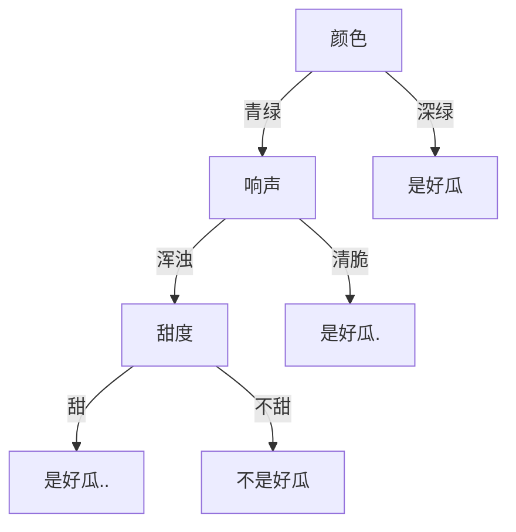
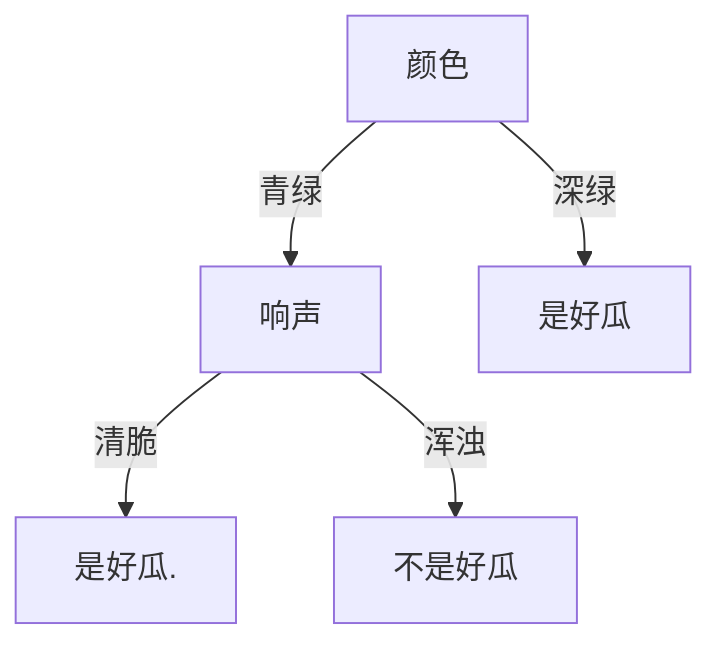
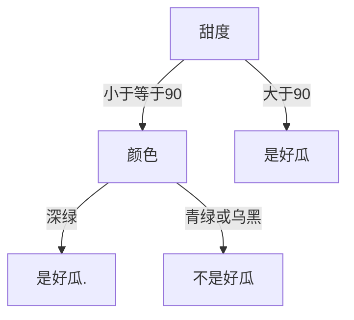

> 决策树(Decision Tree）是在已知各种情况发生概率的基础上，通过构成决策树来求取净现值的期望值大于等于零的概率，评价项目风险，判断其可行性的决策分析方法，是直观运用概率分析的一种图解法。由于这种决策分支画成图形很像一棵树的枝干，故称决策树。在机器学习中，决策树是一个预测模型，他代表的是对象属性与对象值之间的一种映射关系。Entropy = 系统的凌乱程度，使用算法ID3, C4.5和C5.0生成树算法使用熵。这一度量是基于信息学理论中熵的概念。

如果我们有一套数据集：

| 颜色 | 响声 | 甜度 | 好瓜 |
| ---- | ---- | ---- | ---- |
| 青绿 | 浑浊 | 不甜 | 不是 |
| 青绿 | 浑浊 | 不甜 | 不是 |
| 青绿 | 清脆 | 甜   | 是   |
| 青绿 | 浑浊 | 不甜 | 不是 |
| 深绿 | 清脆 | 甜   | 是   |
| 深绿 | 浑浊 | 甜   | 是   |
| 深绿 | 浑浊 | 不甜 | 是   |
| 深绿 | 清脆 | 甜   | 是   |
| 深绿 | 清脆 | 甜   | 是   |

根据数据集，可以生成一套决策树：

然而，上面随便编的决策树是否合理？

关于如何生成决策树，需要涉及一些问题：

- 如何挑选根结点
- 如果挑选分枝结点
- 如何判断是继续向下分枝还是停止
- ...

这就是我们接下来要解决的问题。

# ID3

ID3 算法是一种基于信息熵理论的决策树算法。

ID3 算法的思想：

- 先计算数据集的信息熵
- 再逐个计算每一个条件确定之后的条件熵
- 通过信息熵 - 条件熵得到每个条件的信息增益系数
- 挑选增益最大的条件作为根结点
- 对每个分枝的数据集开始新一轮计算
- 对于每一个数据集，如果结果唯一或数据集个数小于某一阈值，就不再继续分枝

## 计算信息熵

根据数据集：

| 颜色 | 响声 | 甜度 | 好瓜 |
| ---- | ---- | ---- | ---- |
| 青绿 | 浑浊 | 不甜 | 不是 |
| 青绿 | 浑浊 | 不甜 | 不是 |
| 青绿 | 清脆 | 甜   | 是   |
| 青绿 | 浑浊 | 不甜 | 不是 |
| 深绿 | 清脆 | 甜   | 是   |
| 深绿 | 浑浊 | 甜   | 是   |
| 深绿 | 浑浊 | 不甜 | 是   |
| 深绿 | 清脆 | 甜   | 是   |
| 深绿 | 清脆 | 甜   | 是   |

$$
P(是好瓜)=\frac{6}{9},P(不是好瓜)=\frac{3}{9}
$$
计算信息熵：
$$
Ent(X) = -\frac{6}{9}\log_2\frac{6}{9}-\frac{3}{9}\log_2\frac{3}{9} = 0.9183
$$

## 计算条件熵

### 确定颜色的情况

颜色 = 青绿：

| 响声 | 甜度 | 好瓜 |
| ---- | ---- | ---- |
| 浑浊 | 不甜 | 不是 |
| 浑浊 | 不甜 | 不是 |
| 清脆 | 甜   | 是   |
| 浑浊 | 不甜 | 不是 |

$$
Ent(X|颜色=青绿) = -\frac{1}{4}\log_2\frac{1}{4}-\frac{3}{4}\log_2\frac{3}{4} = 0.8113
$$

颜色 = 深绿：

| 响声 | 甜度 | 好瓜 |
| ---- | ---- | ---- |
| 清脆 | 甜   | 是   |
| 浑浊 | 甜   | 是   |
| 浑浊 | 不甜 | 是   |
| 清脆 | 甜   | 是   |
| 清脆 | 甜   | 是   |

$$
Ent(X|颜色=深绿) = -\frac{5}{5}\log_2\frac{5}{5} = 0
$$

故
$$
Ent(X|颜色) = \frac{4}{9}Ent(X|颜色=青绿)+\frac{5}{9}Ent(X|颜色=深绿) = 0.3606
$$

### 确定响声的情况

响声 = 清脆：

| 颜色 | 甜度 | 好瓜 |
| ---- | ---- | ---- |
| 青绿 | 甜   | 是   |
| 深绿 | 甜   | 是   |
| 深绿 | 甜   | 是   |
| 深绿 | 甜   | 是   |

$$
Ent(X|响声=清脆)=-\frac{4}{4}\log_2\frac{4}{4} = 0
$$

响声 = 浑浊：

| 颜色 | 甜度 | 好瓜 |
| ---- | ---- | ---- |
| 青绿 | 不甜 | 不是 |
| 青绿 | 不甜 | 不是 |
| 青绿 | 不甜 | 不是 |
| 深绿 | 甜   | 是   |
| 深绿 | 不甜 | 是   |

$$
Ent(X|响声=浑浊) = -\frac{2}{5}\log_2\frac{2}{5}-\frac{3}{5}\log_2\frac{3}{5} = 0.9710
$$

故
$$
Ent(X|响声) = \frac{4}{9}Ent(X|响声=清脆)+\frac{5}{9}Ent(X|响声=浑浊) = 0.4316
$$

### 确定甜度的情况

甜度 = 甜：

| 颜色 | 响声 | 好瓜 |
| ---- | ---- | ---- |
| 青绿 | 清脆 | 是   |
| 深绿 | 清脆 | 是   |
| 深绿 | 浑浊 | 是   |
| 深绿 | 清脆 | 是   |
| 深绿 | 清脆 | 是   |

$$
Ent(X|甜度=甜) = -\frac{5}{5}\log_2\frac{5}{5}=0
$$

甜度=不甜：

| 颜色 | 响声 | 甜度 | 好瓜 |
| ---- | ---- | ---- | ---- |
| 青绿 | 浑浊 | 不甜 | 不是 |
| 青绿 | 浑浊 | 不甜 | 不是 |
| 青绿 | 浑浊 | 不甜 | 不是 |
| 深绿 | 浑浊 | 不甜 | 是   |

$$
Ent(X|甜度=不甜) = -\frac{4}{4}\log_2\frac{4}{4} = 0.8113
$$

故
$$
Ent(X|甜度) = \frac{5}{9}Ent(X|甜度=甜)+\frac{4}{9}Ent(X|甜度=不甜)=0.3606
$$

## 计算增益系数

$$
Gain(颜色) = Ent(X) - Ent(X|颜色) = 0.5577
$$

$$
Gain(响声) = Ent(X) - Ent(X|响声) = 0.4867
$$

$$
Gain(甜度) = Ent(X) - Ent(X|甜度) = 0.5577
$$

## 挑选根结点

注意到颜色、甜度的增益系数最大，我们可以任选其一，比如将颜色作为根节点。

### 第二次分类：颜色=青绿

数据集为：

| 响声 | 甜度 | 好瓜 |
| ---- | ---- | ---- |
| 浑浊 | 不甜 | 不是 |
| 浑浊 | 不甜 | 不是 |
| 清脆 | 甜   | 是   |
| 浑浊 | 不甜 | 不是 |

按照同样的方法计算出此时的信息熵：
$$
Ent(X) = -\frac{1}{4}\log_2\frac{1}{4}-\frac{3}{4}\log_2\frac{3}{4}=0.8113
$$
计算条件熵：
$$
Ent(X|响声=浑浊) = 0, Ent(X|响声=清脆) = 0
$$
故
$$
Ent(X|响声)=0
$$

$$
Ent(X|甜度=甜) = 0,Ent(X|甜度=不甜) = 0
$$

故
$$
Ent(X|甜度) = 0
$$
计算增益系数：
$$
Gain(响声) = 0.8113
$$

$$
Gain(甜度) = 0.8113
$$

一样大，任选其一，若选择响声，注意到分类后的结果集中：

- 响声=清脆 一定是好瓜
- 响声=浑浊 一定不是好瓜

故不用继续分枝。

### 第二次分类：颜色=深绿

| 响声 | 甜度 | 好瓜 |
| ---- | ---- | ---- |
| 清脆 | 甜   | 是   |
| 浑浊 | 甜   | 是   |
| 浑浊 | 不甜 | 是   |
| 清脆 | 甜   | 是   |
| 清脆 | 甜   | 是   |

注意到结果集只有好瓜，故不用继续分枝。

## 生成决策树

# CART

CART 算法基于基尼系数，它的运算比 ID3 更简单，其特点是只能生成二叉树。

CART 算法的思想：

- 计算数据集的基尼系数
- 计算数据集每个条件下的基尼系数
- 选择最小的基尼系数作为最优切分点
- 对切分出的新数据集开始新一轮计算
- 对于每一个数据集，如果其基尼系数小于某一阈值或数据个数小于某一阈值，就不再继续分枝

为了体现基尼系数的一些特性，下面模拟一套新的数据集：

| 颜色 | 响声 | 甜度 | 好瓜 |
| ---- | ---- | ---- | ---- |
| 青绿 | 浑浊 | 80   | 不是 |
| 青绿 | 浑浊 | 75   | 不是 |
| 深绿 | 清脆 | 80   | 是   |
| 深绿 | 浑浊 | 90   | 是   |
| 乌黑 | 清脆 | 85   | 不是 |
| 乌黑 | 清脆 | 95   | 是   |

## 计算颜色的基尼系数

当样本超过 2 类时，我们需要将样本切分成两类，逐个计算基尼系数后，再找到最佳的切分方法。

### 青绿为一类，深绿或乌黑为一类

$$
Gini(颜色=青绿) = 1-(\frac{2}{2})^2=0
$$

$$
Gini(颜色=深绿或乌黑) = 1-(\frac{3}{4})^2-(\frac{1}{4})^2 = 0.3750
$$

故
$$
Gini(颜色) = \frac{2}{6}Gini(颜色=青绿)+\frac{4}{6}Gini(颜色=深绿或乌黑) = 0.2500
$$

### 深绿为一类，青绿或乌黑为一类

$$
Gini(颜色=深绿) = 1-(\frac{2}{2})^2 = 0
$$

$$
Gini(颜色=青绿或乌黑) = 1-(\frac{3}{4})^2-(\frac{1}{4})^2 = 0.3750
$$

故
$$
Gini(颜色) = \frac{2}{6}Gini(颜色=深绿)+\frac{4}{6}Gini(颜色=青绿或乌黑) = 0.2500
$$

### 乌黑为一类，青绿或深绿为一类

$$
Gini(颜色=乌黑) = 1-(\frac{1}{2})^2-(\frac{1}{2})^2=0.5000
$$

$$
Gini(颜色=青绿或深绿) = 1-(\frac{2}{4})^2-(\frac{2}{4})^2 = 0.5000
$$

故
$$
Gini(颜色) = \frac{2}{6}Gini(颜色=乌黑)+\frac{4}{6}Gini(颜色=青绿或深绿) = 0.5000
$$
综上，最小的基尼系数为：青绿为一类，深绿或乌黑为一类；或深绿为一类，青绿或乌黑为一类，最小值为：
$$
Gini(颜色)_{min} = 0.2500
$$

## 计算响声的基尼系数

由于响声只有两种类型，故不需要多次切分：
$$
Gini(响声=浑浊) = 1-(\frac{2}{3})^2-(\frac{1}{3})^2 = 0.4444
$$

$$
Gini(响声=清脆) = 1-(\frac{2}{3})^2-(\frac{1}{3})^2=0.4444
$$

故
$$
Gini(响声) = \frac{3}{6}Gini(响声=浑浊)+\frac{3}{6}Gini(响声=清脆) = 0.4444
$$

## 计算甜度的基尼系数

注意到甜度是一组连续的变量，要求解连续变量的最优切分点，我们需要对分界位置进行逐个切分。

X = {75, 80, 85, 90, 95}

### {75} 为一类，{80,85,90,95} 为一类

$$
Gini(甜度\in\{75\}) = 1-(\frac{1}{1})^2 = 0
$$

$$
Gini(甜度\in\{80,85,90,95\}) = 1-(\frac{3}{5})^2-(\frac{2}{5})^2 = 0.4800
$$
故
$$
Gini(甜度) = \frac{1}{6}Gini(甜度\in\{75\})+\frac{5}{6}Gini(甜度\in\{80,85,90,95\}) = 0.4000
$$

### {75,80}为一类，{85,90,95}为一类

$$
Gini(甜度\in\{75,80\}) = 1-(\frac{2}{3})^2-(\frac{1}{3})^2 = 0.4444
$$

$$
Gini(甜度\in\{85,90,95\}) = 1-(\frac{2}{3})^2-(\frac{1}{3})^2=0.4444
$$

故
$$
Gini(甜度) = \frac{3}{6}Gini(甜度\in\{75,80\})+\frac{3}{6}Gini(甜度\in\{85,90,95\})=0.4444
$$

### {75,80,85}为一类，{90,95}为一类

$$
Gini(甜度\in\{75,80,85\}) = 1-(\frac{3}{4})^2-(\frac{1}{4})^2 = 0.3750
$$

$$
Gini(甜度\in\{90,95\}) = 1-(\frac{2}{2})^2 = 0
$$

故
$$
Gini(甜度) = \frac{4}{6}Gini(甜度\in\{75,80,85\})+\frac{2}{6}Gini(甜度\in\{90,95\}) = 0.2500
$$

### {75,80,85,90}为一类，{95}为一类

$$
Gini(甜度\in\{75,80,85,90\}) = 1-(\frac{3}{5})^2-(\frac{2}{5})^2 = 0.4800
$$

$$
Gini(甜度\in\{95\}) = 1-(\frac{1}{1})^2 = 0
$$

故
$$
Gini(甜度) = \frac{5}{6}Gini(甜度\in\{75,80,85,90\})+\frac{1}{6}Gini(甜度\in\{95\}) = 0.4000
$$
综上，当{75,80,85}为一类，{90,95}为一类时：
$$
Gini(甜度)_{min} = 0.2500
$$

## 确定最优切分点

$$
Gini(颜色)_{min} = Gini(甜度)_{min}
$$

故任选其一，如选择甜度，则确定切分点为{75,80,85,90} 和 {95}.

## 第二次切分：甜度属于 {75,80,85,90}

| 颜色 | 响声 | 好瓜 |
| ---- | ---- | ---- |
| 青绿 | 浑浊 | 不是 |
| 青绿 | 浑浊 | 不是 |
| 深绿 | 清脆 | 是   |
| 深绿 | 浑浊 | 是   |
| 乌黑 | 清脆 | 不是 |

### 根据颜色切分

$$
Gini(颜色=青绿) = 1-(\frac{2}{2})^2 = 0
$$

$$
Gini(颜色=深绿) = 1-(\frac{2}{2})^2=0
$$

$$
Gini(颜色=乌黑) = 1-(\frac{1}{1}) = 0
$$

$$
Gini(颜色=青绿或深绿) = 1-(\frac{2}{4})^2-(\frac{2}{4})^2=0.5000
$$

$$
Gini(颜色=青绿或乌黑) = 1-(\frac{3}{3})^2 = 0
$$

$$
Gini(颜色=深绿或乌黑) = 1-(\frac{2}{3})^2-(\frac{1}{3})^2 = 0.4444
$$

故深绿为一类，青绿或乌黑为一类时：
$$
Gini(颜色)_{min} = \frac{2}{5}Gini(颜色=深绿) + \frac{3}{5}Gini(颜色=青绿或乌黑) = 0
$$

### 根据响声切分

$$
Gini(响声=浑浊) = 1-(\frac{2}{3})^2-(\frac{1}{3})^2 = 0.4444
$$

$$
Gini(响声=清脆) = 1-(\frac{1}{2})^2-(\frac{1}{2}) = 0.5000
$$

故
$$
Gini(响声) = \frac{3}{5}Gini(响声=浑浊)+\frac{2}{5}Gini(响声=清脆) = 0.4666
$$
综上，选择颜色进行切分，最优切分点为 颜色=深绿 和 颜色=青绿或乌黑。由于切分后结果唯一，故不需要再次切分。

## 第二次切分：甜度属于 {95}

| 颜色 | 响声 | 好瓜 |
| ---- | ---- | ---- |
| 乌黑 | 清脆 | 是   |

只有一种结果，故无需继续切分。

## 生成决策树

