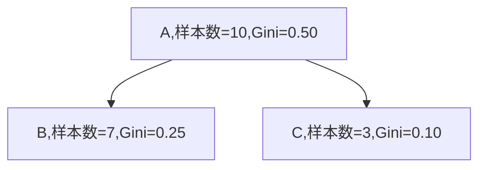
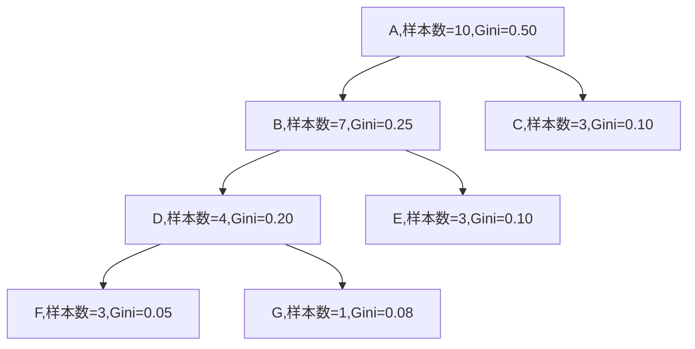
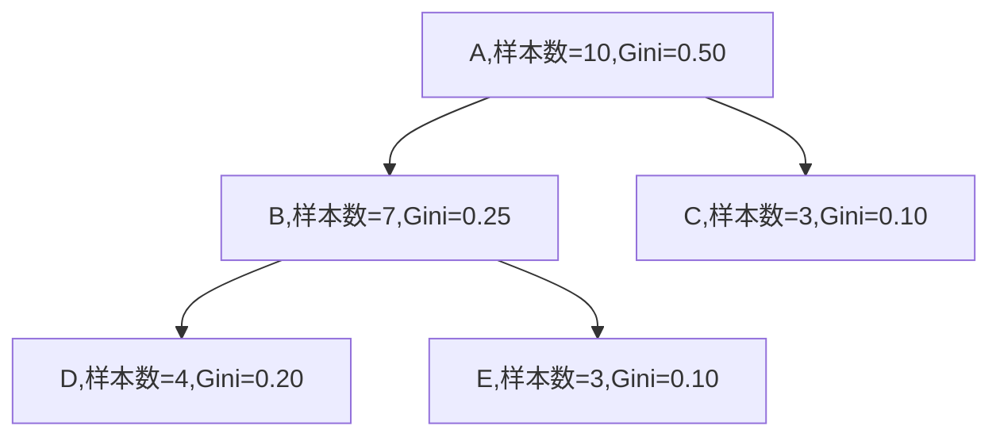

决策树如果任其自由生长，很容易产生过拟合。因此，我们有必要对决策树进行剪枝。

CART 剪枝算法从"完全生长"的决策树的底端剪去一些子树，使决策树变小(模型变简单)，从而能够对未知数据有更准确的预测。

# CART 剪枝

CART 剪枝的思想：

- 从完全生长的整体树 $T_0$ 的最底端开始不断剪枝
- 直至剪到 $T_0$ 的根结点为止，形成子树序列 {$T_0, T_1, ... , T_n$}
- 通过交叉验证法在独立的验证集上对子树序列进行测试，选出最优子树

观察上面的思想，我们很容易想到一些问题：

- 如何挑选剪枝的结点？
- 每个结点是否需要剪枝？

## 剪枝的损失函数

为了控制剪枝的位置和顺序，引入一个损失函数的概念：
$$
C_\alpha(T) = C(T) + \alpha |T|
$$

- T 代表某一子树

- C(T) 代表训练数据的预测误差 (如基尼系数)
- |T|代表子树的结点数
- $\alpha$ 是一个参数，随着 $\alpha$ 的改变，得到的最优子树的复杂度和拟合度也不同

可以想象：

- 当 $\alpha$ 较大时，|T| 的权重更大，此时为使 $C_\alpha(T)$ 较小，最优子树结点数越少(简单，拟合度低)
- 当 $\alpha$ 较小时，C(T) 的权重更大，此时为使 $C_\alpha(T)$ 较小，训练误差也越小，拟合度越高(复杂，拟合度高)
- 当 $a = 0$ 时，最优子树为树本身 $T_0$
- 当 $\alpha \rightarrow +\infty$ 时，最优子树为单独的根节点组成的树

## 剪枝的判断

通过损失函数，我们可以判断一个结点是否应该被剪枝，步骤如下：

对于某一个结点 t，计算以单独的结点 t 组成的树的损失函数：
$$
C_\alpha(t) = C(t)+\alpha \cdot 1
$$
对于该结点 t，计算以 t 为根结点的子树 $T_t$ 的损失函数：
$$
C_\alpha(T_t) = C(T_t) + \alpha|T_t|
$$
当 $\alpha = 0$ 或充分小时，有不等式
$$
C_\alpha(T_t) \lt C_\alpha(t)
$$
随着 $\alpha$ 的增大，必有 $\alpha$ 使得
$$
C_\alpha(T_t) = C_\alpha(t)
$$
此时
$$
\alpha = \frac{C(t)-C(T_t)}{|T_t|-1}
$$
(单结点树 t 的结点数 |t| = 1)

此时就可以对结点 t 进行剪枝，去掉 t 的子结点。

而
$$
g(t) = \frac{C(t)-C(T_t)}{|T_t|-1}
$$
即为判断剪枝的临界值。

举例 (以基尼系数作为损失函数的情况)：

先计算 A 组成的单结点树的损失函数
$$
C(A) = 10 \cdot Gini(A) = 5
$$
再计算 A 为根节点的树 $T_A$ 的损失函数，其中 t 表示树的所有**叶结点**，N(t)表示各个叶结点的样本数(权重)
$$
C(T_A) = \sum_{t=1}^{|T|} N(t)Gini(t) = 7\cdot0.25 + 3\cdot0.10 = 2.05
$$
则
$$
g(A) = \frac{C(A)-C(T_A)}{|T_A|-1} = \frac{5-2.05}{3-1} = 1.475
$$
因此，随着 $\alpha$ 增大到 1.475 时，结点 A 应被剪枝。

## 剪枝的过程

- 对于完整树 $T_0$，计算每一个非叶结点的 g(t) 值
- 对得到的所有 g(t) 进行从小到大排序
- g(t) 从小到大，分别对应第 1, 2, ..., n 个被剪枝的结点
- 对于 $T_0$ 根据第 1 个结点进行剪枝得到 $T_1$
- 对于 $T_1$ 根据第 2 个结点进行剪枝得到 $T_2$
- 如此往复循环，对于 $T_0$，可以生成子树序列 $\{T_0,T_1,...,T_{n}\}$

## 最优子树的挑选

挑选最优子树需要使用独立的验证集，而不是之前的训练集。通过验证集计算出序列中每一个子树的损失函数 (如MSE、Gini) 等指标，选择损失最小的子树作为最优子树，这便可以得到最优决策树。

## 举例

### 计算所有非叶结点的 g(t)

所有非叶结点：ABD

计算每个结点对应单结点树的损失：
$$
C(A) = 10 * 0.5 = 5
$$

$$
C(B) = 7 * 0.25 = 1.75
$$

$$
C(D) = 4 * 0.2 = 0.8
$$

计算每个结点作为根结点对应子树的损失：
$$
C(T_A) = 3*0.1+3*0.1+1*0.08+3*0.05 = 0.83
$$

$$
C(T_B) = 3*0.1+1*0.08+3*0.05 = 0.53
$$

$$
C(T_D) = 1*0.08+3*0.05 = 0.23
$$

计算每个结点的 g(t):
$$
g(A) = \frac{C(A)-C(T_A)}{|T_A|-1} = \frac{5-0.83}{7-1} = 0.6950
$$

$$
g(B) = \frac{C(B)-C(T_B)}{|T_B|-1} = 0.3050
$$

$$
g(D) = \frac{C(D)-C(T_D)}{|T_D|-1} = 0.2850
$$

### 对 g(t) 进行排序

得到的 g(t) 序列：
$$
g(D): 0.2850 < g(B): 0.3050 < g(A): 0.6950
$$

### 按照 g(t) 顺序逐个剪枝生成子树

T1：

T2:

T3:

最后，只需要用测试集对每一个子树进行交叉验证，就可以挑选出最优子树作为决策树。