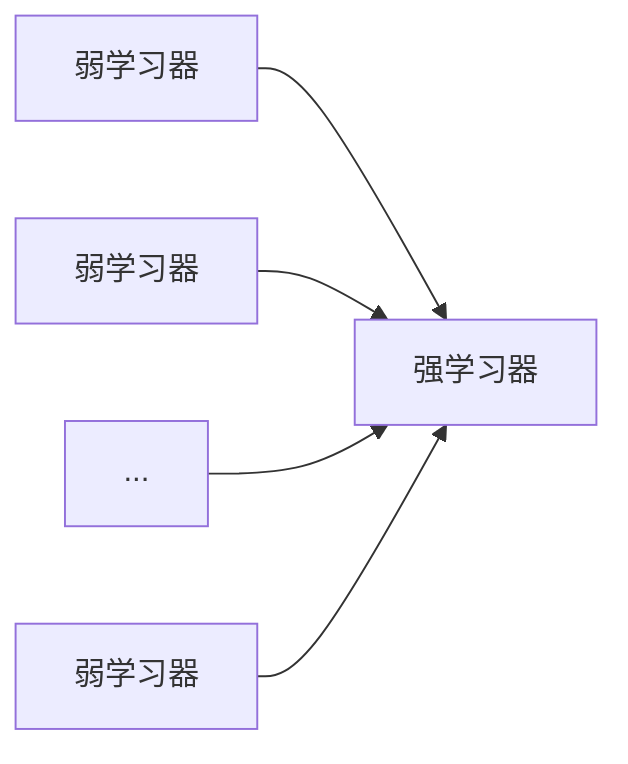

AdaBoost 是一种典型的集成学习算法，通过对多个弱学习器的集合，构成一个强学习器。

<!-- more -->

> Boosting，也称为增强学习或提升法，是一种重要的集成学习技术，能够将预测精度仅比随机猜度略高的弱学习器增强为预测精度高的强学习器。

# AdaBoost

$$
G(x) = sign[f(x)] = sign[\alpha_1G_1(x)+\alpha_2G_2(x)+...+\alpha_nG_n(x)]
$$

- G(x) 表示训练出的集成学习器 (强学习器)
- $G_i(x)$ 表示每一个个体学习器 (弱学习器)

对于数据集

| 序号 | 1    | 2    | 3    | 4    | 5    | 6    | 7    | 8    | 9    | 10   |
| ---- | ---- | ---- | ---- | ---- | ---- | ---- | ---- | ---- | ---- | ---- |
| x    | 0    | 1    | 2    | 3    | 4    | 5    | 6    | 7    | 8    | 9    |
| y    | 1    | 1    | 1    | -1   | -1   | -1   | 1    | 1    | 1    | -1   |

如何找到一个拟合函数？这就可以使用 AdaBoost 求解。

AdaBoost 的思想：

- 训练第 1 个个体学习器，找到最佳分界点
- 计算分类误差，将其作为该学习器的权重
- 增加数据集中分类误差的权重，使其更可能被训练正确
- 对修改数据集权重后的数据集训练第 2 个个体学习器，如此往复
- 将训练得到的所有学习器 * 学习器的权重得到结果

 

AdaBoost 的步骤：

- 创建第 1 个个体学习器 $G_1(x)$，该学习器拥有自己对于每一个 $x_i$ 的权重 $w_i$
- 计算各个分界线 $x = n_i$，$x < n_i$ 时 y = 1，$x > n_i$ 时 y = -1，再计算，$x < n_i$ 时 y = -1，$x > n_i$ 时 y = 1，记录每次的误差 (对于该题来说)
- 找到最优的分界线，分界标准：每个错误的样本 * 权重之和最小
- 记录分类错误的比例得到该学习器的权重
- 根据学习器的分类结果修改权重；对于分类错误的结果，对应权重增加；对于分类正确的结果，对应权重减少 (通过修改权重使得下一次学习时错误结果更加被重视，使其更可能被分对)
- 创建第 2, 3,4 ... 个个体学习器 $G_2(x)$，同样按照上面的步骤训练
- 对于训练得到的所有学习器，通过每个学习器 * 学习器的权重之和得到最后的拟合函数

需要解决的问题：

- 如何更新数据集的权重
- 如何计算学习器的权重
- 训练多少次就停止

# 学习器的权重计算

对于学习器，显然其误差越小，准确度就越高，就应该拥有更大的权重。

于是给出学习器权重的计算公式：
$$
\alpha_i = \frac{1}{2}\log\frac{1-e_i}{e_i}
$$
其中 $e_i$ 表示第 i 个学习器的误差

# 数据集的权重更新

对于数据集的权重，由于误差 = 所有被分错的 x 对应的权重之和，显然数据集中某一个 x 的权重越大，为使误差减小，该 x 越不能被分错。

因为，x 的权重 w 代表其重要程度，越重要就越不能被分错。

那么如何更新 w 呢？计算公式如下
$$
w_{m+1,i} = \frac{w_{m,i}}{Z_m}e^{-\alpha_my_iG_m(x_i)}
$$

$$
其中 Z_m = \sum_{i=1}^Nw_{m,i}e^{-\alpha_my_iG_m(x_i)}
$$

- $w_{m,i}$ 代表第 m 次学习器对应训练集的第 i 个 x 的权重
- $\alpha_m$ 代表第 m 次学习器的权重
- $G_m(x_i)$ 则是第 m 个学习器的拟合函数
- $Z_m$ 的存在是为了进行归一化，确保 $\sum w_{m,i} = 1$

# 第一个学习器

对于数据集

| 序号 | 1    | 2    | 3    | 4    | 5    | 6    | 7    | 8    | 9    | 10   |
| ---- | ---- | ---- | ---- | ---- | ---- | ---- | ---- | ---- | ---- | ---- |
| x    | 0    | 1    | 2    | 3    | 4    | 5    | 6    | 7    | 8    | 9    |
| y    | 1    | 1    | 1    | -1   | -1   | -1   | 1    | 1    | 1    | -1   |

给予初始权重

| w    | 0.1  | 0.1  | 0.1  | 0.1  | 0.1  | 0.1  | 0.1  | 0.1  | 0.1  | 0.1  |
| ---- | ---- | ---- | ---- | ---- | ---- | ---- | ---- | ---- | ---- | ---- |
| x    | 0    | 1    | 2    | 3    | 4    | 5    | 6    | 7    | 8    | 9    |
| y    | 1    | 1    | 1    | -1   | -1   | -1   | 1    | 1    | 1    | -1   |

寻找最优分界点
$$
v=0.5,即f(x) = \left\{
\begin{aligned}
1  & ,x \lt 0.5 \\
-1 & ,x \ge 0.5 \\
\end{aligned}
\right.
$$
此时 x = 1, 2, 6, 7, 8 被分错

计算误差
$$
e_{1,v=0.5} = w_1 + w_2 + w_6 + w_7 +w_8 = 0.5
$$

$$
v=1.5,即f(x) = \left\{
\begin{aligned}
1  & ,x \lt 1.5 \\
-1 & ,x \ge 1.5 \\
\end{aligned}
\right.
$$

此时 x = 2, 6, 7, 8 被分错

计算误差
$$
e_{1,v=1.5} = w_2 + w_6 + w_7 +w_8 = 0.4
$$
综上，遍历所有分界点，最终找到最小的误差为
$$
e_1 = e_{1,v=2.5} = w_6 + w_7 +w_8 = 0.3
$$
第一个学习器的拟合函数 $G_1$
$$
G_1 = \left\{
\begin{aligned}
1  & ,x \le 2.5 \\
-1 & ,x \gt 2.5
\end{aligned}
\right.
$$
计算得到第一个学习器的权重 $\alpha_1$
$$
\alpha_1 = \frac{1}{2}\log\frac{1-e_1}{e_1} = 0.4236
$$
计算得到训练集的更新权重
$$
Z_1 = \sum_{i=1}^{10}w_{1,i}e^{-0.4236y_iG_1(x_i)}
$$

$$
= 7\cdot0.1e^{-0.4236}+3\cdot0.1e^{0.4236} = 0.917
$$

$$
w_{2,1} = \frac{w_{1,1}}{Z_1}e^{-0.4236y_1G_1(x_1)} = \frac{0.1}{0.917}e^{-0.4236} = 0.0714
$$

同理
$$
w_{2,2} = w_{2,3} = w_{2,4} = w_{2,5} = w_{2,6} = w_{2,10} = w_{2,1} = 0.0714
$$

$$
w_{2,7} = w_{2,8} = w_{2,9} = 0.1667
$$

更新后的数据集

| w    | 0.0714 | 0.0714 | 0.0714 | 0.0714 | 0.0714 | 0.0714 | 0.1667 | 0.1667 | 0.1667 | 0.0714 |
| ---- | ------ | ------ | ------ | ------ | ------ | ------ | ------ | ------ | ------ | ------ |
| x    | 0      | 1      | 2      | 3      | 4      | 5      | 6      | 7      | 8      | 9      |
| y    | 1      | 1      | 1      | -1     | -1     | -1     | 1      | 1      | 1      | -1     |

# 第二个学习器

寻找最优分界点并计算误差
$$
e_2 = e_{2_{v=8.5}} = w_3+w_4+w_5 = 0.0714+0.0714+0.0714 = 0.2142
$$
拟合函数
$$
G_2=\left\{
\begin{aligned}
1  & ,x \le 8.5 \\
-1 & ,x \gt 8.5
\end{aligned}
\right.
$$
第二个学习器的权重
$$
\alpha_2 = \frac{1}{2}\log\frac{1-0.2143}{0.2143} = 0.6496
$$
更新后的数据集权重
$$
Z_2 = \sum_{i=1}^{10}w_{2,i}e^{-0.6496y_iG_2(x_i)}
$$

$$
= 0.0714e^{-0.6496}+0.0714e^{-0.6496}+0.0714e^{-0.6496}+0.0714e^{0.6496}+0.0714e^{0.6496}
$$

$$
+0.0714e^{0.6496}+0.1667e^{-0.6496}+0.1667e^{-0.6496}+0.1667e^{-0.6496}+0.0714e^{-0.6496}
$$

$$
=0.8205
$$

$$
w_{3,1} = \frac{w_{2,1}}{Z_2}e^{-0.6496} = 0.0455
$$

同理更新所有权重

| w    | 0.0455 | 0.0455 | 0.0455 | 0.1667 | 0.1667 | 0.1667 | 0.1060 | 0.1060 | 0.1060 | 0.0455 |
| ---- | ------ | ------ | ------ | ------ | ------ | ------ | ------ | ------ | ------ | ------ |
| x    | 0      | 1      | 2      | 3      | 4      | 5      | 6      | 7      | 8      | 9      |
| y    | 1      | 1      | 1      | -1     | -1     | -1     | 1      | 1      | 1      | -1     |

# 第三个学习器

同样按照上面的步骤计算
$$
G_3=\left\{
\begin{aligned}
-1 & ,x \le 5.5 \\
1  & ,x \gt 5.5
\end{aligned}
\right.
$$

| w    | 0.125 | 0.125 | 0.125 | 0.102 | 0.102 | 0.102 | 0.065 | 0.065 | 0.065 | 0.125 |
| ---- | ----- | ----- | ----- | ----- | ----- | ----- | ----- | ----- | ----- | ----- |
| x    | 0     | 1     | 2     | 3     | 4     | 5     | 6     | 7     | 8     | 9     |
| y    | 1     | 1     | 1     | -1    | -1    | -1    | 1     | 1     | 1     | -1    |

# 生成拟合函数

经过 3 次训练后，得到每个弱学习器的拟合函数
$$
G_1 = \left\{
\begin{aligned}
1  & ,x \le 2.5 \\
-1 & ,x \gt 2.5
\end{aligned}
\right.
$$

$$
G_2=\left\{
\begin{aligned}
1  & ,x \le 8.5 \\
-1 & ,x \gt 8.5
\end{aligned}
\right.
$$

$$
G_3=\left\{
\begin{aligned}
-1 & ,x \le 5.5 \\
1  & ,x \gt 5.5
\end{aligned}
\right.
$$

合成强学习器的拟合函数
$$
f_3(x) = \alpha_1G_1(x)+\alpha_2G_2(x)+\alpha_3G_3(x)
$$

$$
=\left\{
\begin{aligned}
0.3218  & ,x \le 2.5 \\
-0.5214 & ,2.5 \lt x \le 5.5 \\
0.9774  & ,5.5 \lt x \le 8.5 \\
-0.3218 & ,8.5 \le x \\
\end{aligned}
\right.
$$

归一化处理后
$$
f_3(x) = \alpha_1G_1(x)+\alpha_2G_2(x)+\alpha_3G_3(x)
$$

$$
=\left\{
\begin{aligned}
1  & ,x \le 2.5 \\
-1 & ,2.5 \lt x \le 5.5 \\
1  & ,5.5 \lt x \le 8.5 \\
-1 & ,8.5 \le x \\
\end{aligned}
\right.
$$

对比数据集，所有数据都被分类正确！

# 什么时候停止训练

第一种方案：设定训练次数，训练次数到达后就停止

第二种方案：训练无法再提高准确率时就停止

接下来介绍一下方案二。

根据上面的学习器，如果只训练一次：
$$
f_1(x) = \alpha_1G_1(x)
$$

$$
=\left\{
\begin{aligned}
0.4236  & ,x \le 2.5 \\
-0.4236 & ,x \gt 2.5 \\
\end{aligned}
\right.
$$

归一化后
$$
f_1(x)=\left\{
\begin{aligned}
1  & ,x \le 2.5 \\
-1 & ,x \gt 2.5 \\
\end{aligned}
\right.
$$

此时有 3 个点被分错。

如果训练两次：
$$
f_2(x) = \alpha_1G_1(x)+\alpha_2G_2(x)
$$

$$
=\left\{
\begin{aligned}
1.0732  & ,x \le 2.5 \\
0.226   & ,2.5 \lt x \le 8.5 \\
-0.6496 & ,8.5 \lt x \\
\end{aligned}
\right.
$$

归一化后
$$
f_3(x)=\left\{
\begin{aligned}
1  &, x \le 8.5 \\
-1 & ,8.5 \lt x \\
\end{aligned}
\right.
$$
此时仍有 3 个点被分错。

而第 3 次训练后
$$
f_3(x) = \alpha_1G_1(x)+\alpha_2G_2(x)+\alpha_3G_3(x)
$$

$$
=\left\{
\begin{aligned}
1  & ,x \le 2.5 \\
-1 & ,2.5 \lt x \le 5.5 \\
1  & ,5.5 \lt x \le 8.5 \\
-1 & ,8.5 \le x \\
\end{aligned}
\right.
$$

没有点被分错，故此时就可以停止训练。

若多次训练后准确率没有得到有效提升，训练同样应该停止。