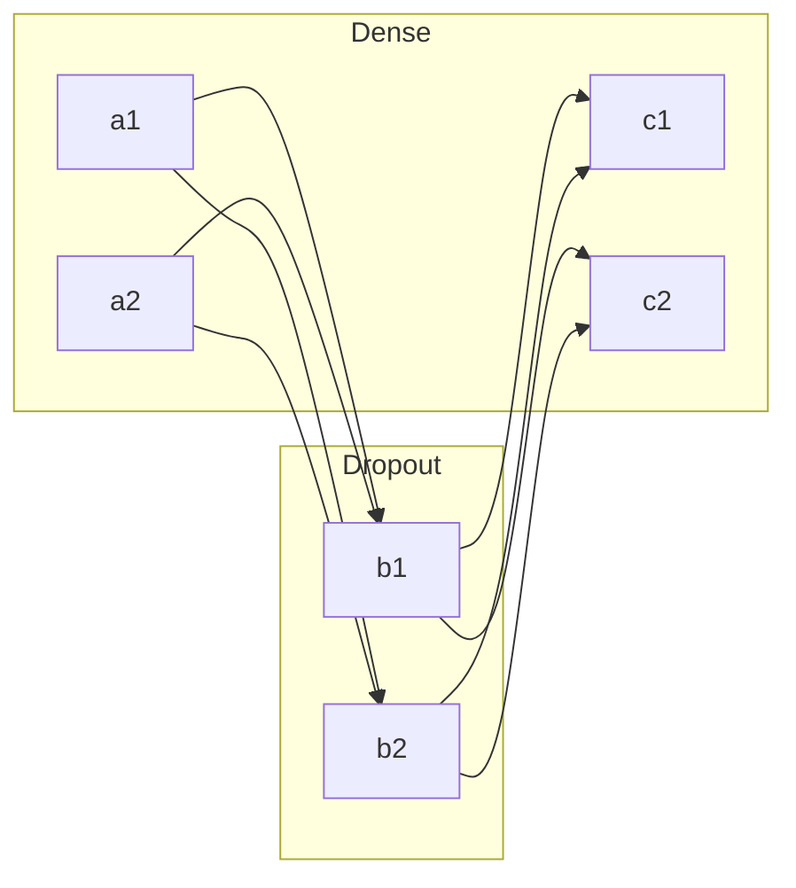
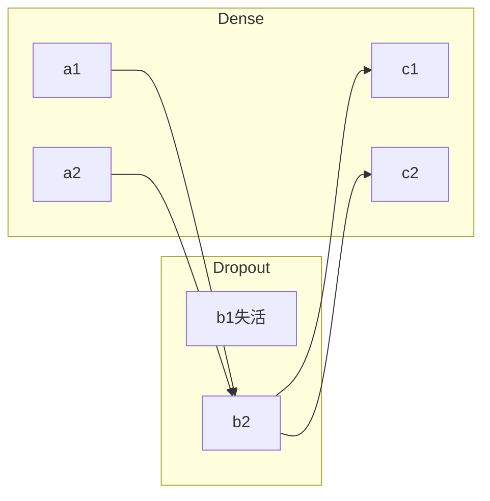

记录一下昨天半夜学的东西，以下代码均通过tensorflow2自带的keras实现。

# 卷积神经网络(CNN)
- 为什么要使用卷积神经网络？
卷积神经网络常用于图像处理。它可以提取关键信息，如图片轮廓、主色调等信息，在减少喂入数据量的同时，又能增加模型深度，提高准确率。其具体实现笔者将在下文中介绍。
## 概念
### 卷积
卷积是通过两个函数f 和g 生成第三个函数的一种数学算子，可以理解为，在原函数f上，通过函数g进行处理，得到结果函数。这个处理卷积过程的g，就是卷积核。

为了便于理解，举一种简单情况（选用离散数列进行演示，连续数列会更加麻烦）：
$$
原函数：f = [1,4,6,3,5,9,7],\\
卷积核：g = [1,-2,1]
$$

接下来，卷积核从左向右移动，每三个元素通过卷积核得到结果，如：
$$
1 \times 1 + 4 \times (-2) + 6 \times 1 = -1，得到第一个结果为-1\\
4 \times 1 + 6 \times (-2) + 3 \times 1 = -5，得到第一个结果为-5\\
……
$$

$$
\begin{matrix}
1&4&6&3&5&9&7\\\\
1&-2&1&\\
\rightarrow&1&-2&1\\
&\rightarrow&1&-2&1\\
&&\rightarrow&1&-2&1\\
&&&\rightarrow&1&-2&1\\\\
&\downarrow&\downarrow&\downarrow&\downarrow&\downarrow\\
&-1&-5&5&2&-6&\qquad
\end{matrix}
$$

最终得到的数列就是卷积后的结果。

上面的例子是一维矩阵（数列）的卷积，对于二维、三维甚至更高维的矩阵，都可以这样类比。

举一个例子：
$$
原函数：f = 
\begin{pmatrix}
1&4&8&3\\
-4&5&-1&2\\
8&-2&4&-6
\end{pmatrix}
\\
卷积核：g = 
\begin{pmatrix}
1&-1\\-1&1
\end{pmatrix}
$$

同样，卷积核需要逐个移动，例如先从左往右，再从上往下，遍历每一块元素：
$$
第一个元素：
\begin{pmatrix}
1&4\\-4&5
\end{pmatrix} \times
\begin{pmatrix}
1&-1\\-1&1
\end{pmatrix}\\
= 1 \times 1 + 4 \times (-1) + (-4) \times (-1) + 5 \times 1 = 9\\
\rightarrow第二个元素：
\begin{pmatrix}
4&8\\5&-1
\end{pmatrix} \times
\begin{pmatrix}
1&-1\\-1&1
\end{pmatrix}\\
= 4 \times 1 + 8 \times (-1) + 5 \times (-1) + (-1) \times 1 = -10\\
……
$$

最终结果：
$$
\begin{pmatrix}
9&-10&8\\-19&12 &-13
\end{pmatrix}
$$

动图演示：

更高维的卷积都可以用这种方法推广。
#### 卷积核
上面的例子已经介绍了卷积核，卷积核非常神奇，图像像素排列成的矩阵在通过卷积核可以实现锐化、模糊、边缘、浮雕等效果，因此，我们可以使用卷积核提取关键信息。

下面是一些图像处理常用卷积核：
$$
均值模糊：
\begin{pmatrix}
1/9&1/9&1/9\\
1/9&1/9&1/9\\
1/9&1/9&1/9
\end{pmatrix}\\
锐化：
\begin{pmatrix}
-1&-1&-1\\
-1&9&-1\\
-1&-1&-1
\end{pmatrix}\\
Soble边缘检测：
\begin{pmatrix}
-1&0&1\\
-2&0&2\\
-1&0&1
\end{pmatrix}
$$

这里笔者使用OpenCV2演示效果，代码如下：
```python
# !usr/bin/env python
# -*- coding: utf-8 -*-
# @Date: 2020/6/15
# @Author: Koorye

import cv2
import numpy as np

if __name__ == '__main__':
    img = cv2.imread('data/img/lena.jpg')
    cv2.imshow('Lena', img)

    blur = np.array([[1 / 9, 1 / 9, 1 / 9], [1 / 9, 1 / 9, 1 / 9], [1 / 9, 1 / 9, 1 / 9]], np.float32)
    sharp = np.array([[-1, -1, -1], [-1, 9, -1], [-1, -1, -1]], np.float32)
    soble = np.array([[-1, 0, 1], [-2, 0, 2], [-1, 0, 1]], np.float32)

    blur_dst = cv2.filter2D(img, -1, kernel=blur)
    sharp_dst = cv2.filter2D(img, -1, kernel=sharp)
    soble_dst = cv2.filter2D(img, -1, kernel=soble)

    cv2.imshow('blur', blur_dst)
    cv2.imshow('sharp', sharp_dst)
    cv2.imshow('soble', soble_dst)

    cv2.waitKey(0)
```

运行结果：

通过修改卷积核的数值和尺寸，还可以得到不同效果的图片。

#### 全零填充
之前卷积的例子，在卷积之后都会丢失宽度（高度），原来7个元素的数列变成了5个元素，原来4x3的矩阵变成了3x2，这与原函数和卷积核的维度和尺寸有关。

要解决宽度（高度）的丢失问题，有一个解决思路，就是使用全零填充，即在边缘加上0.

如：
$$
原函数：f = [1,4,6,3,5,9,7],\\
卷积核：g = [1,-2,1]
$$

卷积的结果是：$1,-5,5,2,-6$.

但如果使用全零填充，就变成：
$$
原函数：f = [0,1,4,6,3,5,9,7,0],\\
卷积核：g = [1,-2,1]
$$

卷积的结果是：$2,1,-5,5,2,-6,-5$.

通过全零填充，梳理（矩阵）的尺寸得以保留，这可以有效缓解网络层数加深后数据量减少的问题。

### 批标准化
批标准化(Batch Normalization)是一种用于改善人工神经网络的性能和稳定性的技术，简称BN算法。

批标准化和标准化类似，用于将数据规范到一定的范围内，以便计算。

笔者非该专业，无法深入讲解，仅在此简单介绍其作用。
### 池化
池化是一种采样方法，它可以提取数据特征，减少数据量并缓解过拟合。下面介绍一下两种池化方法：

#### 均值池化
顾名思义，即取平均值。
首先将源数据分块，然后取每块的平均值，如：
$$
\begin{pmatrix}
4&6&|&8&2\\
7&3&|&2&9\\
\text{—}&\text{—}&\text{—}&\text{—}&\text{—}\\
8&4&|&9&1\\
4&3&|&2&5
\end{pmatrix}\rightarrow
\begin{pmatrix}
5&10.5\\9.5&8.5
\end{pmatrix}
$$
#### 最大值池化
最大值池化也很好理解，即取最大值：
$$
\begin{pmatrix}
4&6&|&8&2\\
7&3&|&2&9\\
\text{—}&\text{—}&\text{—}&\text{—}&\text{—}\\
8&4&|&9&1\\
4&3&|&2&5
\end{pmatrix}\rightarrow
\begin{pmatrix}
5&5.25\\4.75&4.25
\end{pmatrix}
$$
### 失活
随机失活(Dropout)是对具有深度结构的人工神经网络进行优化的方法，在学习过程中通过将隐含层的部分权重或输出随机归零，降低节点间的相互依赖性从而实现神经网络的正则化，降低其结构风险。

如何实现呢？每次，我们可以选用神经层中的部分神经元，下次训练时再选用其他部分，通过这样的选取，可以有效缓解过拟合等问题。

图例：


接下来，Dropout层会随机失活，例如，使b1失活，构成的神经网络：


通过每次随机选择神经元失活，就可以保持神经网络的稳定性和活性。
## CNN结构
有了上面的介绍，概括CNN卷积神经网络的结构：
卷积(Convolutional) → 批标准化(BN) → 激活(Activation) → 池化(Pooling) → 失活(Dropout)* → 全连接(FC)

概括为CBAPD.

简单演示tensorflow2的keras搭建CNN神经网络，以下是一个典型的解决多分类问题（如图片内容分类）的代码：
```python
# !usr/bin/env python
# -*- coding: utf-8 -*-
# @Date: 2020/6/15
# @Author: Koorye

import tensorflow as tf
import numpy as np

if __name__ == '__main__':
	# 需要提供数据集
	# x_train, x_test, y_train, y_test = ...
	
    model = tf.keras.Sequential(
    	# 卷积层，filters指定卷积核数量，kernal_size指定卷积核尺寸
    	# padding指定是否使用全零填充
        tf.keras.layers.Conv2D(filters=6, kernal_size=(5, 5), padding='same'),
        # 批标准化
        tf.keras.layers.BatchNormalization(),
        # relu激活函数
        tf.keras.layers.Activation('relu'),
        # 池化，pool_size指定池尺寸，strides指定池间隔，默认与尺寸一致
        tf.keras.layers.MaxPool2D(pool_size=(2, 2), strides=2, padding='same'),
        # 随机失活，指定每次失活20%的神经元
        tf.keras.layers.Dropout(0.2),
        # 数据平铺成一维数组
        tf.keras.layers.Flatten(),
        # 全连接，128个神经元，relu激活函数
        tf.keras.layers.Dense(128, activation='relu'),
        # 随机失活
        tf.keras.layers.Dropout(0.2),
        # 全连接，10个神经元，softmax激活函数，用于解决多分类问题
        tf.keras.layers.Dense(10, activation='softmax')
    )
	
	# 模型编译，optimize指定adam优化器，loss指定损失函数为均方差
    model.compile(optimize='adam', loss='mse')
	
	# 模型训练，batch_size指定每次喂入的数据量，epochs指定训练次数
	# validation_data指定验证集，validation_freq指定多少次训练进行一次验证
    model.fit(x_train, y_train, batch_size=32, epochs=5, validation_data=(x_test, y_test), validation_freq=1)
```